# CSI St. Mark's Church, Madipakkam — Website & Portal

The complete web platform for CSI St. Mark's Church, Madipakkam: a bilingual
(English / Tamil) public website, and the admin CMS and content API that feed it.

| | |
|---|---|
| **Public website** | Next.js 16 (App Router), React 19, Tailwind CSS 4, `next-intl` |
| **Admin CMS** | Next.js 16, TanStack Query, Radix UI, `react-hook-form` |
| **API** | NestJS, MongoDB (Mongoose), JWT auth with refresh rotation |
| **Language** | TypeScript throughout, with a shared contract package |
| **Runtime** | Node.js ≥ 20 |
| **Deployment** | Single Docker image (API + CMS + MongoDB), ZimaOS / CasaOS or any Docker host |

---

## Table of contents

- [Repository layout](#repository-layout)
- [Architecture](#architecture)
  - [System context](#system-context)
  - [Portal internals](#portal-internals)
  - [Deployment topology](#deployment-topology)
  - [Publish-to-live sequence](#publish-to-live-sequence)
  - [Request paths](#request-paths)
- [Data model](#data-model)
  - [ER diagram](#er-diagram)
  - [Collections](#collections)
  - [Embedded types](#embedded-types)
  - [Enumerations](#enumerations)
- [Authentication and authorisation](#authentication-and-authorisation)
- [API surface](#api-surface)
- [Complete architecture](#complete-architecture)
- [Data model](#data-model)
- [API reference](#api-reference)
- [Authorisation matrix](#authorisation-matrix)
- [WebsiteRT](#websitert--the-public-website)
- [The mobile CMS](#the-mobile-cms--stmarks_portal_app)
- [Terms of use](#terms-of-use)
- [Privacy notice](#privacy-notice)
- [Accessibility statement](#accessibility-statement)
- [The website's church calendar](#the-websites-church-calendar)
- [Content ownership](#content-ownership--what-the-cms-owns-and-what-the-code-owns)
- [Getting started](#getting-started)
- [Environment variables](#environment-variables)
- [Deployment](#deployment)
- [Backup and restore](#backup-and-restore)
- [Security](#security)
- [Conventions](#conventions)

---

## Repository layout

**Five** top-level projects, in three languages. They are **not** a single npm
workspace — each is installed and built on its own.

```
.
├── Portal/               Admin CMS + content API   (npm workspaces monorepo)
│   ├── shared/           @portal/shared — types, enums, role→permission matrix
│   ├── backend/          @portal/backend — NestJS REST API      :4000  /v1
│   ├── frontend/         @portal/frontend — Next.js admin CMS   :3001
│   ├── docs/             API contract and design notes
│   └── scripts/          contract parity, Postman export, bundle build
│
├── Portal-Docker/        The same Portal, packaged as ONE Docker image
│   ├── docker/           entrypoint router, snapshot restore, launch
│   ├── snapshot/         shipped content, media and accounts for first boot
│   └── docker-compose.zimaos.yml   ← import this on ZimaOS / CasaOS
│
├── WebsiteRT/            Public website — ACTIVE
│   ├── src/lib/          incl. liturgical-year.ts — the church calendar
│   ├── docs/             seasons, and the content brief for the church
│   └── scripts/          incl. verify-season-script.mjs
│
├── stmarks_portal_app/   Portal as a mobile app  (Flutter, `csi_portal`)
│   └── lib/features/     the same 18 areas the web CMS covers
│
└── Website/              Public website — earlier iteration, superseded
```

### On the duplicated projects

Two pairs look redundant and are not quite:

**`Portal/` and `Portal-Docker/`** share the same application source but differ
in about 25 files, all of them about *how it is hosted*: `main.ts`,
`configure-app.ts`, `app.module.ts`, production config validation, a request
interceptor, and the whole `docker/` directory. `Portal/` is what you develop
against — two servers, your own MongoDB. `Portal-Docker/` is what ships — one
container that brings its own database and content.

**`WebsiteRT/` and `Website/`** are two iterations of the public site.
**`WebsiteRT/` is current**; `Website/` predates it by 42 differing or unique
files and is kept for reference.

### The mobile client

`stmarks_portal_app/` is a **Flutter** app — the Portal's CMS as a phone app
rather than a second product. It signs in against the same NestJS API on
`:4000/v1`, and its `lib/features/` directory covers the same ground as the web
CMS: announcements, blog, church content, connect, contact, downloads, events,
fellowships, gallery, media, users, roles, audit, backup and settings.

Riverpod for state, `go_router` for routing, `dio` for HTTP. The API base URL is
entered at runtime and stored on the device — there is no compiled-in host, so
one build works against a laptop, a ZimaOS box or a hosted server.

Because it consumes the same contract as the CMS, **a breaking change to the API
now breaks three clients rather than two.** `Portal/scripts/` has a contract
parity check for the two web projects; the Flutter models are not yet in it.

> If you are starting work: **`Portal/`** and **`WebsiteRT/`**.
>
> Carrying two near-copies of each is a real maintenance cost — a fix to a
> content schema has to be applied in both Portal trees. Consolidating
> `Portal-Docker/` into a build target of `Portal/`, and retiring `Website/`,
> is the obvious next structural cleanup. It is deliberately **not** done here,
> because it is a judgement call about the project's direction rather than a
> documentation task.

---

## Architecture

### System context

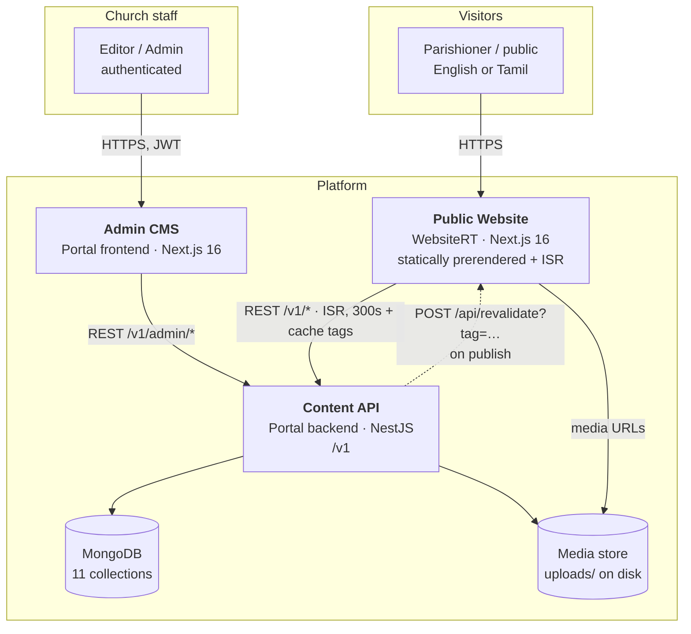

Two properties are worth naming, because most of the design follows from them:

1. **The website never talks to the database.** It reads the same public REST
   contract any other client would. That is why it can fall back to fixture
   data and still render (see [Getting started](#getting-started)).
2. **Publishing is push, not poll.** The API tells the website which content
   changed; the website drops exactly those cache tags. Without this, an edit
   takes up to five minutes to appear and — worse — an index page and a detail
   page can disagree about the same record in the meantime.

### Portal internals

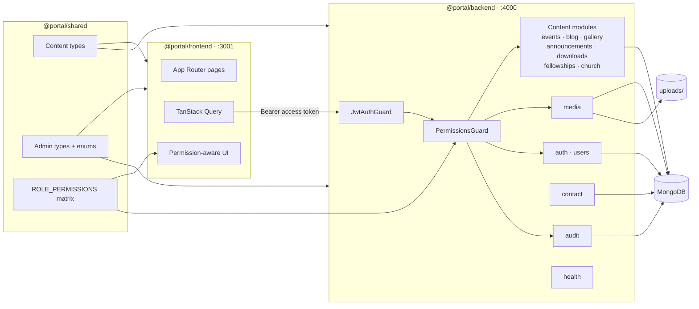

`@portal/shared` is the reason the CMS and the API cannot drift: the publish
statuses, the media kinds, the fellowship slugs and the **role→permission matrix
are declared once** and imported by both. The backend guard and the frontend's
"can this user see this button" check read the same object.

### Deployment topology

Production is a **single container**. One image holds the API, the CMS, a
`mongod`, and a snapshot of the church's content — so a parish with no
infrastructure can run it, and losing the volume is the only way to lose data.

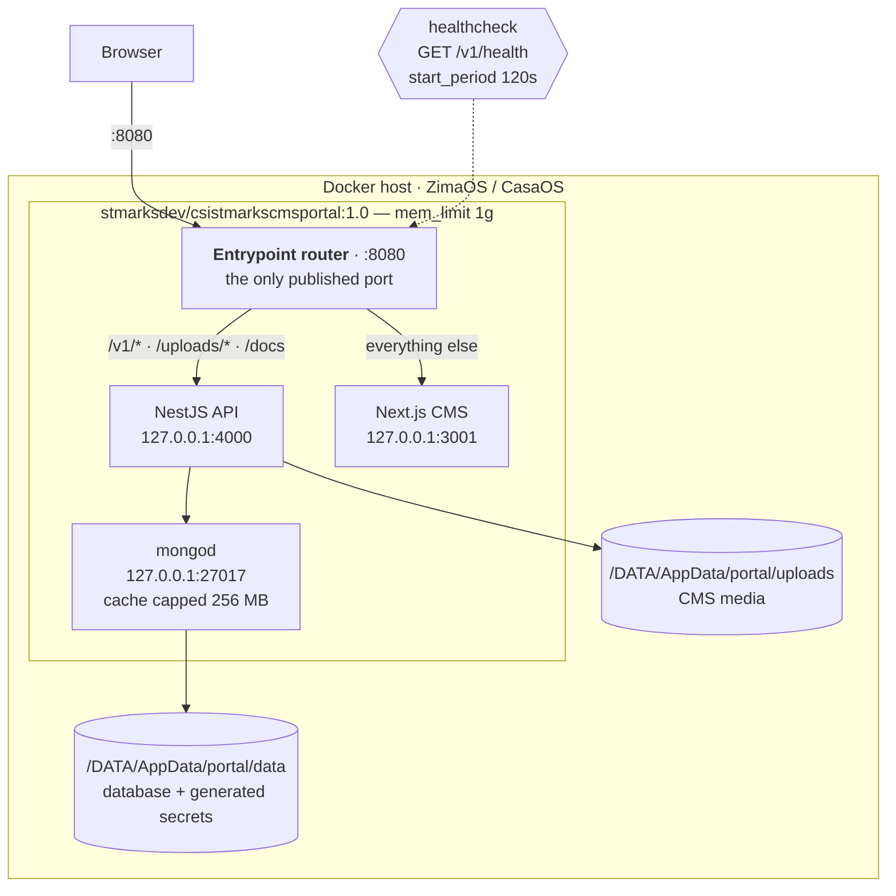

Three things in that diagram are load-bearing, and each exists because of a
failure that actually happened:

- **The API and CMS bind to loopback**, not `0.0.0.0`. Only the router is
  published, so the two servers share one origin and the CMS's API calls are
  same-origin. (`SPLIT_PORTS=true` exposes them separately, and then
  `NEXT_PUBLIC_API_URL` must be set too.)
- **No `environment:` block in the ZimaOS compose.** Its importer does not
  expand `${VAR}` syntax — it stores the text literally, so a defaulted
  `JWT_ACCESS_SECRET` arrives as a 22-character string, the API refuses to start
  on a secret under 32 characters, and the container boot-loops with no visible
  cause. The container generates real secrets into its volume on first boot
  instead.
- **`start_period: 120s`.** First boot restores 567 documents and 261 media
  files before anything listens. A shorter grace period makes the orchestrator
  restart a container that is doing exactly what it was told to.

### Publish-to-live sequence

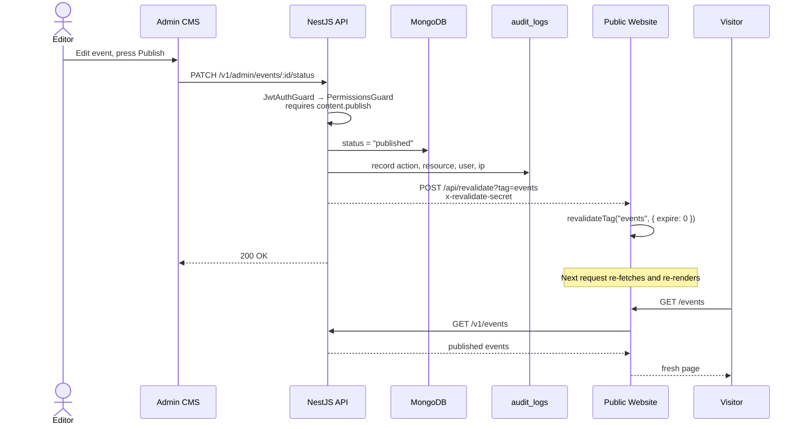

`{ expire: 0 }` rather than `"max"` is deliberate. `"max"` marks the tag stale
and serves stale-while-revalidate, so the **first** visitor after a publish still
gets the old content — including the editor who just pressed Publish and
reloaded to check. They would reasonably conclude it had not worked.

### Request paths

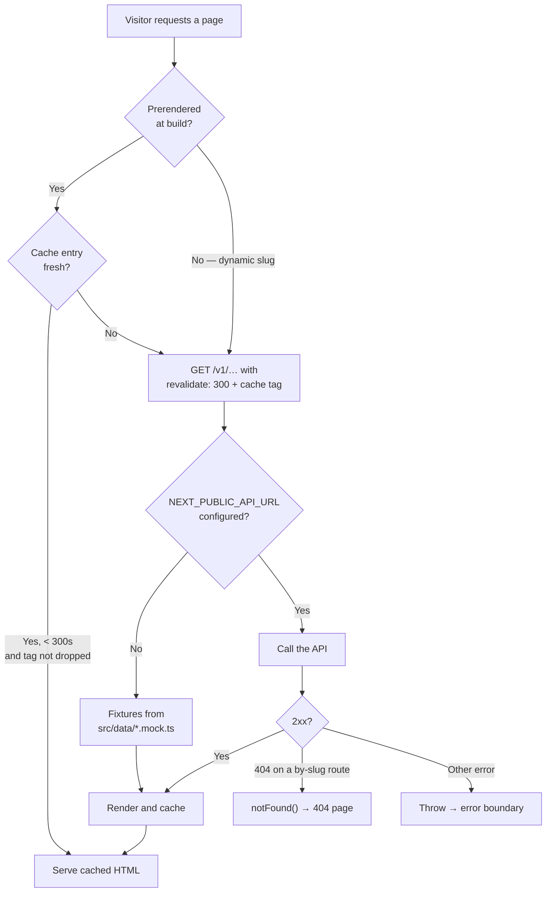

The fallback is **configuration-driven only**. With `NEXT_PUBLIC_API_URL` unset
the site renders from fixtures; once it is set, a failing request throws rather
than silently serving fixtures — because a page quietly showing last year's
service times is worse than one that errors.

---

## Data model

MongoDB, 11 collections, accessed through Mongoose schemas in
`Portal/backend/src/modules/*/schemas/`.

### Read this before reading the diagram

**There are no `ObjectId` references anywhere in the content model.** Documents
are joined by **slug strings**, and MongoDB enforces none of it. The diagram
below draws those as relationships because that is what they mean, but they are
application-level conventions:

- Cross-collection slug fields (`fellowshipSlug`, `eventSlug`) are validated
  against a TypeScript enum on write, not against the target collection. A
  `fellowshipSlug` can name a fellowship that does not exist yet.
- Deletes do not cascade. Removing a fellowship leaves every event, album and
  download pointing at a slug with nothing behind it.
- `ImageAsset.url` is a plain string. Nothing links a piece of content to the
  `media` document its image came from, so the media library cannot tell you
  what is using a file.

Those are the three things to keep in mind when changing this schema.

### ER diagram


`..` is used throughout instead of `--` as a reminder that **none of these are
enforced by the database.**

### Collections

| Collection | Purpose | Identity | Workflow |
|---|---|---|---|
| `fellowships` | The eight parish fellowships | `slug` (fixed enum) | defaults to `published` |
| `events` | Church events | `slug` | `draft` → publish |
| `blog_posts` | Articles, optionally tied to an event | `slug` | `draft` → publish |
| `gallery_albums` | Photo albums with embedded photos and videos | `slug` | `draft` → publish |
| `announcements` | Notices, pinnable | `slug` | `draft` → publish |
| `downloads` | Bulletins, forms, documents | `slug` | `draft` → publish |
| `media` | Upload library — images, video, PDF, documents | `_id` | n/a |
| `users` | CMS accounts | `email` unique | `active` flag |
| `audit_logs` | Who changed what, append-only | `_id` | `createdAt` only |
| `church_singletons` | Service timings, pastor's message, weekly verse | `key` unique | overwrite |
| `contact_messages` | Website contact form submissions | `_id` | `read` flag |

`church_singletons` is a key/value table with a `Mixed` payload — three fixed
keys, each with its own shape. It trades schema enforcement for not needing
three collections and three modules to hold one document each.

### Embedded types

Defined in `Portal/backend/src/common/schemas/sub-schemas.ts` and mirrored in
`@portal/shared`:

| Type | Shape | Notes |
|---|---|---|
| `LocalizedText` | `{ en, ta }` | **Both required**, default `""`. Every visible string. |
| `ImageAsset` | `{ url, alt: LocalizedText, width, height }` | Dimensions required — the website needs them to reserve space and avoid layout shift. |
| `GalleryPhoto` | `{ id, image, caption?, video? }` | Embedded in an album. |
| `GalleryVideo` | `{ url, provider: file\|youtube\|vimeo }` | A gallery item can be a video. |
| `CommitteeMember` | `{ id, name, designation, image? }` | Embedded in a fellowship. |
| `Coordinator` | `{ name, phone?, email? }` | One per fellowship. |

Bilingual content is structural, not an afterthought: `LocalizedText` requires
**both** `en` and `ta`, so a half-translated record is representable but visible
as an empty string rather than a missing key.

### Enumerations

Single-sourced in `@portal/shared`, so the API guard, the CMS UI and the
website's types cannot disagree.

```
PUBLISH_STATUSES     draft · published · archived
USER_ROLES           super-admin · admin · editor · viewer
MEDIA_KINDS          image · video · pdf · document
DOWNLOAD_CATEGORIES  bulletin · form · document
SINGLETON_KEYS       service-timings · pastor-message · weekly-verse
FELLOWSHIP_SLUGS     youth-fellowship · young-couple-fellowship · sunday-school
                     choir · womens-fellowship · mens-fellowship
                     prayer-fellowship · other-fellowships
```

---

## Authentication and authorisation

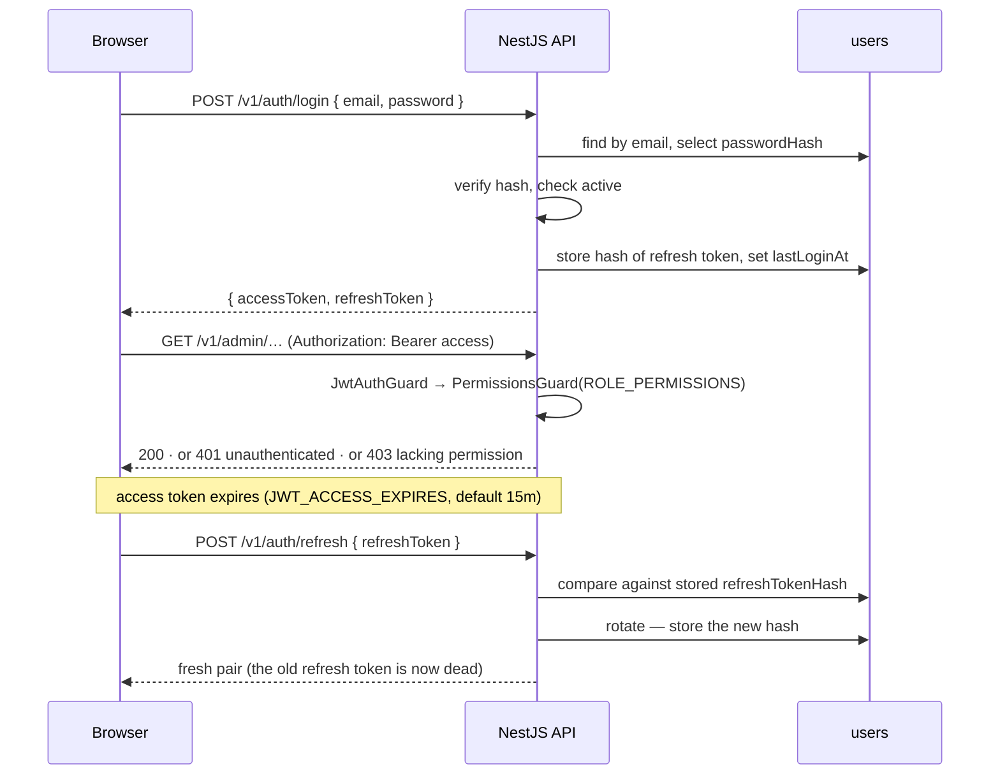

Two deliberate choices:

- **Refresh tokens are rotated and stored as a hash.** One `refreshTokenHash`
  per user, replaced on every refresh, so a stolen refresh token stops working
  the moment the real user refreshes — and `POST /v1/auth/logout` clears it,
  which makes logout server-side rather than a client discarding a string.
- **`passwordHash` and `refreshTokenHash` are `select: false`.** They are not
  returned unless explicitly asked for, so a careless `findOne().lean()` in a
  new endpoint cannot leak them.

### Role → permission matrix

Declared once in `Portal/shared/src/admin.ts` as `ROLE_PERMISSIONS`.

| Permission | super-admin | admin | editor | viewer |
|---|:--:|:--:|:--:|:--:|
| `content.read` | ✅ | ✅ | ✅ | ✅ |
| `content.write` | ✅ | ✅ | ✅ | — |
| `content.publish` | ✅ | ✅ | — | — |
| `content.delete` | ✅ | ✅ | — | — |
| `media.read` | ✅ | ✅ | ✅ | ✅ |
| `media.write` | ✅ | ✅ | ✅ | — |
| `media.delete` | ✅ | ✅ | — | — |
| `users.read` | ✅ | ✅ | — | — |
| `users.write` | ✅ | — | — | — |
| `audit.read` | ✅ | ✅ | — | — |
| `audit.delete` | ✅ | — | — | — |
| `settings.write` | ✅ | ✅ | — | — |
| `contact.read` | ✅ | ✅ | — | — |

Read the file rather than this table if the two ever disagree — the file is what
the guard executes. Note the two super-admin-only powers: creating users, and
purging audit history (which erases the record of who did what).

---

## API surface

Base URL `\<host\>/v1`. OpenAPI/Swagger is served by the API; health is
`GET /v1/health`.

**Public** — no auth, published content only:

```
GET  /v1/events                    GET  /v1/announcements
GET  /v1/events/:slug              GET  /v1/announcements/pinned
GET  /v1/blog                      GET  /v1/downloads
GET  /v1/blog/slugs                GET  /v1/downloads/grouped
GET  /v1/blog/:slug                GET  /v1/fellowships
GET  /v1/gallery                   GET  /v1/church/service-timings
GET  /v1/gallery/:slug             GET  /v1/church/pastor-message
POST /v1/contact                   GET  /v1/church/weekly-verse
```

**Admin** — `Authorization: Bearer …` plus the permission shown:

```
/v1/auth/login · refresh · logout · me · change-password
/v1/admin/events          GET · GET :id · POST · PATCH :id · PATCH :id/status · DELETE :id
/v1/admin/blog            same shape
/v1/admin/gallery         same shape
/v1/admin/downloads       same shape
/v1/admin/announcements   same shape, plus PATCH :id/pin
/v1/admin/fellowships     GET · PATCH
/v1/admin/church          GET/PUT service-timings · pastor-message · weekly-verse
/v1/admin/media           upload · list · delete
/v1/admin/users           CRUD                      (users.read / users.write)
/v1/admin/contact-messages GET · PATCH :id/read · DELETE :id   (contact.read)
/v1/admin/audit-logs      GET · DELETE              (audit.read / audit.delete)
/v1/admin/backup          preview · POST · restore  (backup.read / backup.restore)
```

The status transition is its own endpoint (`PATCH :id/status`) rather than a
field on the update body, so publishing is a separately permissioned action —
an `editor` can save a draft but cannot make it live.

Contract tooling in `Portal/`:

```bash
npm run check:contract   # asserts the API matches the documented contract
npm run postman          # regenerates a Postman collection
```

---

## The website's church calendar

The public site **dresses itself for the church's year**. Nothing is scheduled,
stored or switched on: it works out today's season from the visitor's own date
and restyles accordingly. This is the largest piece of behaviour in `WebsiteRT/`
that has no counterpart in the Portal, so it is summarised here and documented
in full in [`WebsiteRT/docs/liturgical-seasons.md`](WebsiteRT/docs/liturgical-seasons.md).

### The eight seasons

| Season | When | What changes |
|---|---|---|
| **Christmas** | 1 Dec – 1 Jan | Red on snow-white; snowfall, string lights, a treeline in every section, a frieze and greeting at the foot |
| **Ash Wednesday** | Easter − 46 | Ash; falling dust, an imposition table — bowl, thumbed cross, palm fronds |
| **Lent** | to the eve of Palm Sunday | Ashen violet; bare branches, veils, stones |
| **Holy Week** | Palm Sunday – Holy Saturday | Deeper ash and crimson |
| **Good Friday** | one day | **Every scale drained to pure neutral.** Calvary, crown of thorns, nails. Photographs stay in colour |
| **Easter** | 50 days | Everything glows; light shafts, lilies, the empty tomb, the Paschal greeting |
| **CSI Day** | 27 September | Both colours of the parish seal |
| **Ordinary time** | the rest | The site at rest |

### How it works, in three files

| File | Knows about |
|---|---|
| `src/lib/liturgical-year.ts` | **Dates only.** Gregorian computus, season boundaries. No React, no DOM, no colour |
| `src/components/common/liturgical-season.tsx` | Resolves today's season, writes `<html data-season>` |
| `src/styles/globals.css` | **Colour only.** One block per season |

The split is the point: the calendar file knows nothing about colour, and the
stylesheet knows nothing about dates.

Seasons are resolved **client-side**, because every page is statically
prerendered — a season decided at build time would arrive with a deploy and
leave with one. It resolves twice: an inline `next/script` with
`strategy="beforeInteractive"` sets it **before first paint** (the splash screen
is up for as little as 1.9s and would otherwise be over before hydration), and
`LiturgicalSeason` confirms it afterwards.

### Previewing, and the one script you must run

Any route takes `?season=` — `christmas`, `ash-wednesday`, `lent`, `holy-week`,
`good-friday`, `easter`, `csi-day`, `ordinary` — plus `?snow` / `?snow=0`. The
choice sticks as you browse and resets on a clean reload. An unrecognised value
is ignored rather than honoured.

> The pre-paint bootstrap is a **hand-inlined copy** of the date arithmetic — an
> ES import cannot be made to run before hydration. If you change `getSeason`,
> change the bootstrap too and run:
>
> ```bash
> cd WebsiteRT && node scripts/verify-season-script.mjs
> ```
>
> It extracts the shipped bootstrap string, runs it under Node, and compares it
> against the real `getSeason` on **every day from 2024 to 2044** — 7,671 days —
> failing on the first disagreement. The failure mode it guards against is the
> worst kind: nobody notices until Good Friday.

### Accessibility, stated once

Every season was contrast-checked across seven text/ground pairings; all pass
WCAG AA, the lowest reading in the year being 7.9:1. Seasons move **colour and
light only** — never type size, layout or navigation. Everything decorative is
`aria-hidden` and `pointer-events-none`, sits behind the content layer, and
stills or disappears under `prefers-reduced-motion`.

---

## Content ownership — what the CMS owns and what the code owns

A recurring question, and the answer is not what the folder names suggest.
The full brief written *for the church* is
[`WebsiteRT/docs/content-requirements.md`](WebsiteRT/docs/content-requirements.md).

| Managed in the Portal | Hard-coded in `WebsiteRT/` |
|---|---|
| Events, blog, gallery, announcements, downloads | Church profile — address, phone, email, office hours, socials |
| Fellowships | History, vision & mission, diocese details |
| **Weekly verse** (changes weekly) | **Leadership** — pastors, committee, staff, and the presbyter roll |
| Service timings | All UI wording, in both languages |
| Pastor's message | Hero photography, the crest, the cinematic frames |
| Contact inbox, media library, users | Navigation structure, site URL |

Two of these are worth revisiting rather than accepting: **committee members**
change on election, and **a phone number** can change at any time — both
currently need a developer and a deploy.

> **Everything is required in both English and Tamil**, on both sides of that
> table. `LocalizedText = { en, ta }` on every translatable field; a missing
> `ta` shows the English to a Tamil reader, which is the failure the bilingual
> setup exists to prevent.

---

## Complete architecture

Everything in this section is generated from the source and re-checked on each
update: **94 endpoints across 13 modules**,
**11 collections** carrying **95 mapped fields**,
**15 permissions** over 4 roles, and a public site of **14
routes** built from **63 components**.

### C4 level 1 — system context

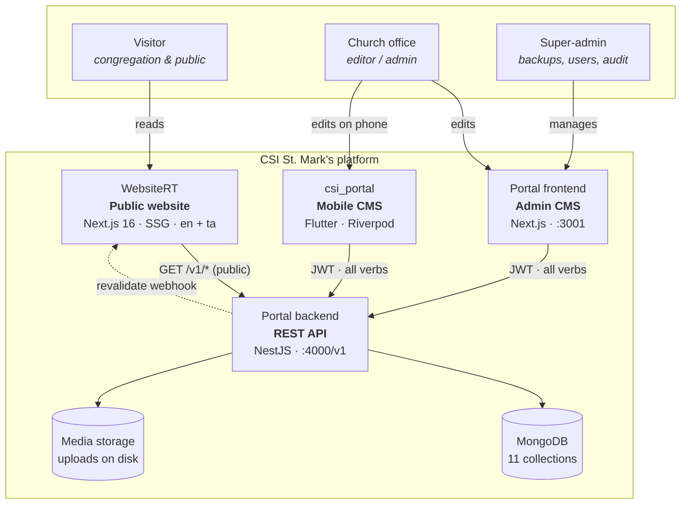

**The one-way rule.** The website only ever *reads*, and only ever from the
19 public endpoints. It holds no credentials and cannot write. Every
mutation goes through an authenticated client.

### C4 level 2 — containers and ports

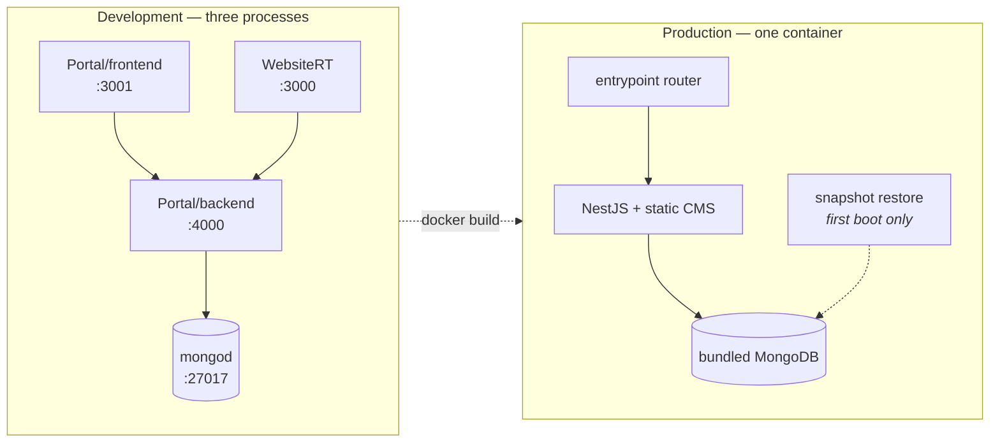

### Request paths, end to end

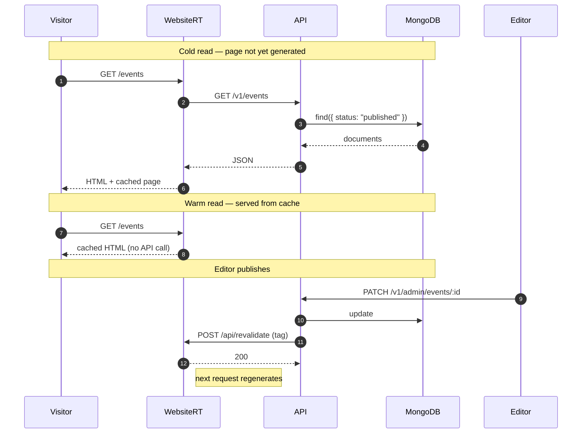

### Authentication flow

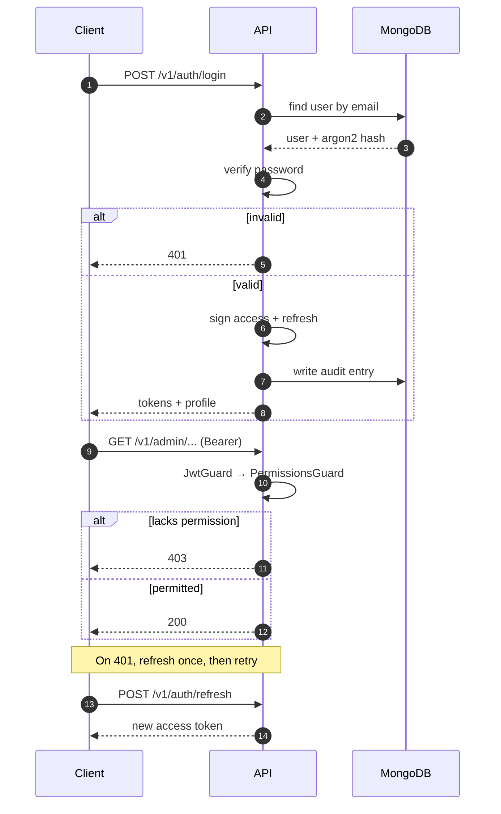

### Content lifecycle

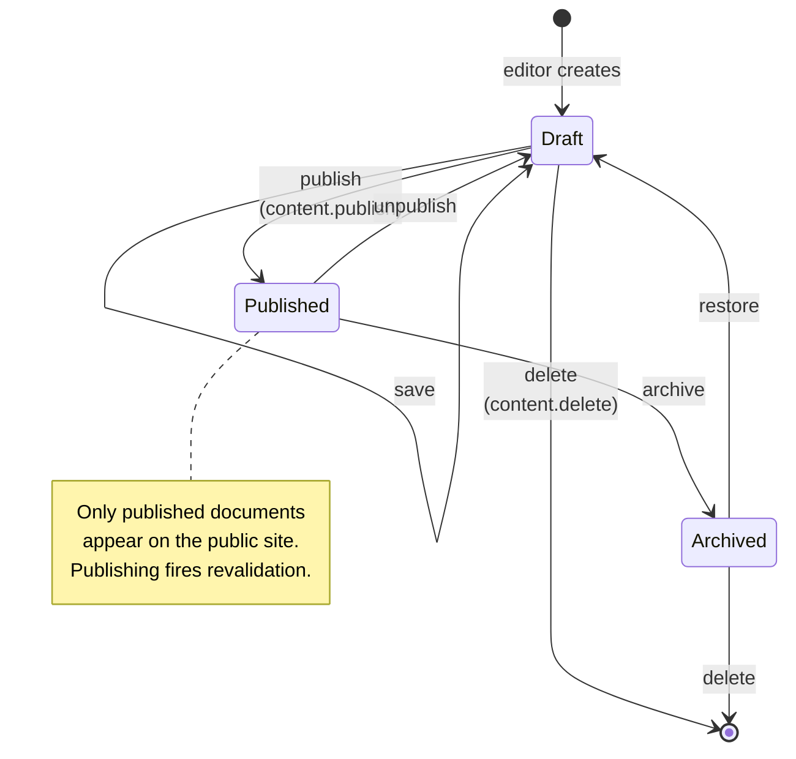

### The seasonal layer (WebsiteRT only)

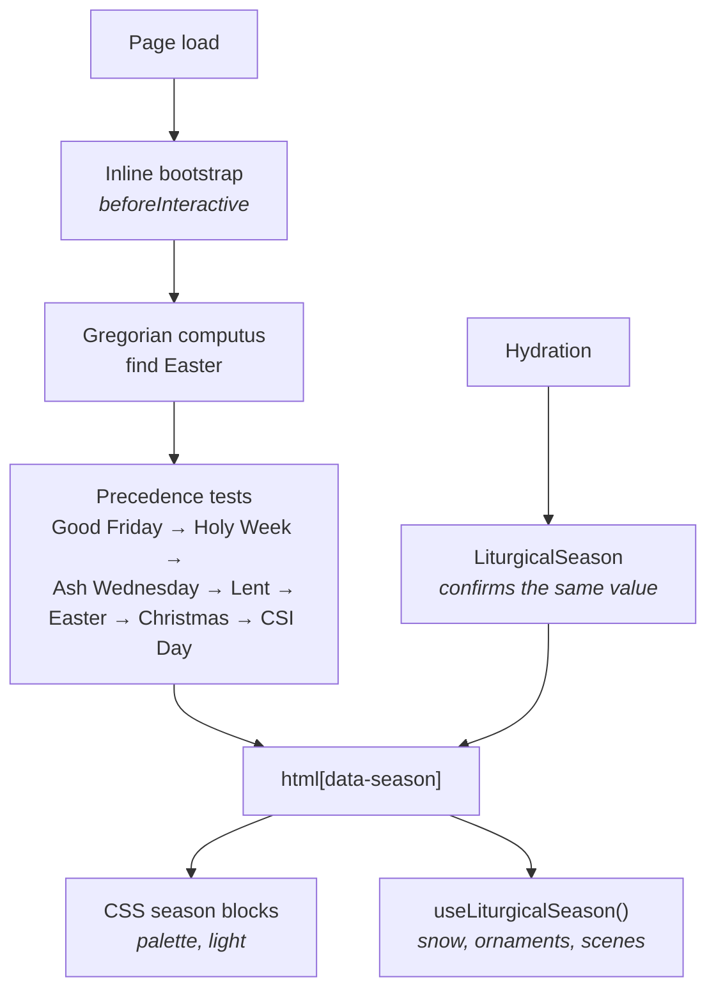

---

## Data model

### Entity relationships

```mermaid
erDiagram
    Announcement {
        string slug "required, unique, indexed"
        PublishStatus status "required, indexed"
        LocalizedText title "required"
        LocalizedText body "required"
        Date publishedAt "required, indexed"
        boolean pinned "indexed"
        FellowshipSlug fellowshipSlug "indexed"
    }
    AuditLog {
        AuditAction action "required, indexed"
        string resource "required, indexed"
        string resourceId
        string summary "required"
        string userId "indexed"
        string userName
        string ip
    }
    BlogPost {
        string slug "required, unique, indexed"
        PublishStatus status "required, indexed"
        LocalizedText title "required"
        LocalizedText excerpt "required"
        LocalizedText__ body
        Date publishedAt "required, indexed"
        LocalizedText author "required"
        ImageAsset coverImage
        string eventSlug "indexed"
        FellowshipSlug fellowshipSlug "indexed"
        number readingMinutes
    }
    Singleton {
        SingletonKey key "required, unique"
        unknown data "required"
    }
    ContactMessage {
        string name "required"
        string email "required"
        string phone
        string subject "required"
        string message "required"
        boolean read "indexed"
    }
    Download {
        string slug "required, unique, indexed"
        PublishStatus status "required, indexed"
        LocalizedText title "required"
        LocalizedText description
        DownloadCategory category "required, indexed"
        string fileUrl "required"
        string format "required"
        string size "required"
        Date publishedAt "required, indexed"
        FellowshipSlug fellowshipSlug "indexed"
    }
    ChurchEvent {
        string slug "required, unique, indexed"
        PublishStatus status "required, indexed"
        LocalizedText title "required"
        LocalizedText summary "required"
        LocalizedText__ description
        Date startDate "required, indexed"
        Date endDate
        LocalizedText location "required"
        ImageAsset image
        FellowshipSlug fellowshipSlug "indexed"
        LocalizedText organiser
        boolean featured "indexed"
    }
    Fellowship {
        FellowshipSlug slug "required, unique, indexed"
        PublishStatus status "required, indexed"
        LocalizedText name "required"
        LocalizedText tagline "required"
        LocalizedText__ about
        LocalizedText vision "required"
        LocalizedText schedule "required"
        number memberCount
        ImageAsset banner "required"
        FellowshipCommitteeMembe committee
        __name__LocalizedText coordinator "required"
        number order "required"
    }
    GalleryAlbum {
        string slug "required, unique, indexed"
        PublishStatus status "required, indexed"
        LocalizedText title "required"
        LocalizedText description
        Date date "required, indexed"
        ImageAsset cover "required"
        GalleryPhoto__ photos
        FellowshipSlug fellowshipSlug "indexed"
        boolean shared "indexed"
    }
    Media {
        MediaKind kind "required, indexed"
        string path "required"
        string thumbnailPath
        string filename "required"
        string mimeType "required"
        string format "required"
        number sizeBytes "required"
        string size "required"
        number width
        number height
        string blurDataURL
        LocalizedText alt
    }
    User {
        string name "required"
        string email "required, unique"
        string passwordHash "required"
        UserRole role "required"
        boolean active
        Date lastLoginAt
        string refreshTokenHash
    }
```

### Collection reference


#### `Announcement`

`Portal/backend/src\modules\announcements\schemas\announcement.schema.ts` — 7 fields

| Field | Type | Constraints |
|---|---|---|
| `slug` | `string` | required, unique, indexed |
| `status` | `PublishStatus` | required, indexed, enum, default `"draft"` |
| `title` | `LocalizedText` | required |
| `body` | `LocalizedText` | required |
| `publishedAt` | `Date` | required, indexed |
| `pinned` | `boolean` | indexed, default `false` |
| `fellowshipSlug` | `FellowshipSlug` | indexed, enum |

#### `AuditLog`

`Portal/backend/src\modules\audit\schemas\audit-log.schema.ts` — 7 fields

| Field | Type | Constraints |
|---|---|---|
| `action` | `AuditAction` | required, indexed, enum |
| `resource` | `string` | required, indexed |
| `resourceId` | `string` | — |
| `summary` | `string` | required |
| `userId` | `string` | indexed |
| `userName` | `string` | — |
| `ip` | `string` | — |

#### `BlogPost`

`Portal/backend/src\modules\blog\schemas\blog-post.schema.ts` — 11 fields

| Field | Type | Constraints |
|---|---|---|
| `slug` | `string` | required, unique, indexed |
| `status` | `PublishStatus` | required, indexed, enum, default `"draft"` |
| `title` | `LocalizedText` | required |
| `excerpt` | `LocalizedText` | required |
| `body` | `LocalizedText[]` | default `[]` |
| `publishedAt` | `Date` | required, indexed |
| `author` | `LocalizedText` | required |
| `coverImage` | `ImageAsset` | — |
| `eventSlug` | `string` | indexed |
| `fellowshipSlug` | `FellowshipSlug` | indexed, enum |
| `readingMinutes` | `number` | — |

#### `ChurchEvent`

`Portal/backend/src\modules\events\schemas\event.schema.ts` — 12 fields

| Field | Type | Constraints |
|---|---|---|
| `slug` | `string` | required, unique, indexed |
| `status` | `PublishStatus` | required, indexed, enum, default `"draft"` |
| `title` | `LocalizedText` | required |
| `summary` | `LocalizedText` | required |
| `description` | `LocalizedText[]` | default `[]` |
| `startDate` | `Date` | required, indexed |
| `endDate` | `Date` | — |
| `location` | `LocalizedText` | required |
| `image` | `ImageAsset` | — |
| `fellowshipSlug` | `FellowshipSlug` | indexed, enum |
| `organiser` | `LocalizedText` | — |
| `featured` | `boolean` | indexed, default `false` |

#### `ContactMessage`

`Portal/backend/src\modules\contact\schemas\contact-message.schema.ts` — 6 fields

| Field | Type | Constraints |
|---|---|---|
| `name` | `string` | required |
| `email` | `string` | required |
| `phone` | `string` | — |
| `subject` | `string` | required |
| `message` | `string` | required |
| `read` | `boolean` | indexed, default `false` |

#### `Download`

`Portal/backend/src\modules\downloads\schemas\download.schema.ts` — 10 fields

| Field | Type | Constraints |
|---|---|---|
| `slug` | `string` | required, unique, indexed |
| `status` | `PublishStatus` | required, indexed, enum, default `"draft"` |
| `title` | `LocalizedText` | required |
| `description` | `LocalizedText` | — |
| `category` | `DownloadCategory` | required, indexed, enum |
| `fileUrl` | `string` | required |
| `format` | `string` | required |
| `size` | `string` | required |
| `publishedAt` | `Date` | required, indexed |
| `fellowshipSlug` | `FellowshipSlug` | indexed, enum |

#### `Fellowship`

`Portal/backend/src\modules\fellowships\schemas\fellowship.schema.ts` — 12 fields

| Field | Type | Constraints |
|---|---|---|
| `slug` | `FellowshipSlug` | required, unique, indexed, enum |
| `status` | `PublishStatus` | required, indexed, enum, default `"published"` |
| `name` | `LocalizedText` | required |
| `tagline` | `LocalizedText` | required |
| `about` | `LocalizedText[]` | default `[]` |
| `vision` | `LocalizedText` | required |
| `schedule` | `LocalizedText` | required |
| `memberCount` | `number` | — |
| `banner` | `ImageAsset` | required |
| `committee` | `FellowshipCommitteeMember[]` | default `[]` |
| `coordinator` | `{ name: LocalizedText` | required |
| `order` | `number` | required, default `0` |

#### `GalleryAlbum`

`Portal/backend/src\modules\gallery\schemas\gallery-album.schema.ts` — 9 fields

| Field | Type | Constraints |
|---|---|---|
| `slug` | `string` | required, unique, indexed |
| `status` | `PublishStatus` | required, indexed, enum, default `"draft"` |
| `title` | `LocalizedText` | required |
| `description` | `LocalizedText` | — |
| `date` | `Date` | required, indexed |
| `cover` | `ImageAsset` | required |
| `photos` | `GalleryPhoto[]` | default `[]` |
| `fellowshipSlug` | `FellowshipSlug` | indexed, enum |
| `shared` | `boolean` | indexed, default `false` |

#### `Media`

`Portal/backend/src\modules\media\schemas\media.schema.ts` — 12 fields

| Field | Type | Constraints |
|---|---|---|
| `kind` | `MediaKind` | required, indexed, enum |
| `path` | `string` | required |
| `thumbnailPath` | `string` | — |
| `filename` | `string` | required |
| `mimeType` | `string` | required |
| `format` | `string` | required |
| `sizeBytes` | `number` | required |
| `size` | `string` | required |
| `width` | `number` | — |
| `height` | `number` | — |
| `blurDataURL` | `string` | — |
| `alt` | `LocalizedText` | — |

#### `Singleton`

`Portal/backend/src\modules\church\schemas\singleton.schema.ts` — 2 fields

| Field | Type | Constraints |
|---|---|---|
| `key` | `SingletonKey` | required, unique, enum |
| `data` | `unknown` | required |

#### `User`

`Portal/backend/src\modules\users\schemas\user.schema.ts` — 7 fields

| Field | Type | Constraints |
|---|---|---|
| `name` | `string` | required |
| `email` | `string` | required, unique |
| `passwordHash` | `string` | required |
| `role` | `UserRole` | required, enum, default `"editor"` |
| `active` | `boolean` | default `true` |
| `lastLoginAt` | `Date` | — |
| `refreshTokenHash` | `string` | — |

---

## API reference

**94 endpoints.** Base URL `/{API_PREFIX}` — `/v1` by default.
Public endpoints need no credentials; every other route requires a Bearer token
and the permission named in the Access column.


#### `announcements` — 9 endpoints

| Method | Path | Handler | Access |
|---|---|---|---|
| `GET` | `/admin/announcements` | `RequirePermissions` | authenticated |
| `POST` | `/admin/announcements` | `RequirePermissions` | `content.read` |
| `DELETE` | `/admin/announcements/:id` | `RequirePermissions` | `content.publish` |
| `GET` | `/admin/announcements/:id` | `RequirePermissions` | authenticated |
| `PATCH` | `/admin/announcements/:id` | `RequirePermissions` | `content.write` |
| `PATCH` | `/admin/announcements/:id/pin` | `RequirePermissions` | `content.write` |
| `PATCH` | `/admin/announcements/:id/status` | `RequirePermissions` | authenticated |
| `GET` | `/announcements` | `ApiOperation` | **public** |
| `GET` | `/announcements/pinned` | `ApiOperation` | **public** |

#### `audit` — 2 endpoints

| Method | Path | Handler | Access |
|---|---|---|---|
| `DELETE` | `/admin/audit-logs` | `RequirePermissions` | authenticated |
| `GET` | `/admin/audit-logs` | `RequirePermissions` | authenticated |

#### `auth` — 6 endpoints

| Method | Path | Handler | Access |
|---|---|---|---|
| `POST` | `/auth/change-password` | `HttpCode` | authenticated |
| `POST` | `/auth/login` | `HttpCode` | authenticated |
| `POST` | `/auth/logout` | `HttpCode` | authenticated |
| `GET` | `/auth/me` | `ApiBearerAuth` | authenticated |
| `PATCH` | `/auth/me` | `ApiBearerAuth` | authenticated |
| `POST` | `/auth/refresh` | `HttpCode` | authenticated |

#### `backup` — 5 endpoints

| Method | Path | Handler | Access |
|---|---|---|---|
| `POST` | `/admin/backup` | `RequirePermissions` | `backup.read` |
| `GET` | `/admin/backup/:id/download` | `Public` | authenticated |
| `GET` | `/admin/backup/preview` | `RequirePermissions` | authenticated |
| `POST` | `/admin/backup/restore` | `RequirePermissions` | authenticated |
| `POST` | `/admin/backup/restore/:id` | `RequirePermissions` | authenticated |

#### `blog` — 9 endpoints

| Method | Path | Handler | Access |
|---|---|---|---|
| `GET` | `/admin/blog` | `RequirePermissions` | authenticated |
| `POST` | `/admin/blog` | `RequirePermissions` | `content.read` |
| `DELETE` | `/admin/blog/:id` | `RequirePermissions` | `content.publish` |
| `GET` | `/admin/blog/:id` | `RequirePermissions` | authenticated |
| `PATCH` | `/admin/blog/:id` | `RequirePermissions` | `content.read` |
| `PATCH` | `/admin/blog/:id/status` | `RequirePermissions` | `content.write` |
| `GET` | `/blog` | `ApiOperation` | **public** |
| `GET` | `/blog/:slug` | `ApiOperation` | **public** |
| `GET` | `/blog/slugs` | `ApiOperation` | **public** |

#### `church` — 9 endpoints

| Method | Path | Handler | Access |
|---|---|---|---|
| `GET` | `/admin/church/pastor-message` | `RequirePermissions` | authenticated |
| `PUT` | `/admin/church/pastor-message` | `ApiOperation` | `content.read` |
| `GET` | `/admin/church/service-timings` | `RequirePermissions` | `content.write` |
| `PUT` | `/admin/church/service-timings` | `ApiOperation` | `content.read` |
| `GET` | `/admin/church/weekly-verse` | `RequirePermissions` | authenticated |
| `PUT` | `/admin/church/weekly-verse` | `ApiOperation` | `content.read` |
| `GET` | `/church/pastor-message` | `ApiOperation` | **public** |
| `GET` | `/church/service-timings` | `ApiOperation` | **public** |
| `GET` | `/church/weekly-verse` | `ApiOperation` | **public** |

#### `contact` — 4 endpoints

| Method | Path | Handler | Access |
|---|---|---|---|
| `GET` | `/contact` | `RequirePermissions` | authenticated |
| `POST` | `/contact` | `HttpCode` | authenticated |
| `DELETE` | `/contact/:id` | `RequirePermissions` | `contact.read` |
| `PATCH` | `/contact/:id/read` | `RequirePermissions` | authenticated |

#### `downloads` — 8 endpoints

| Method | Path | Handler | Access |
|---|---|---|---|
| `GET` | `/admin/downloads` | `RequirePermissions` | authenticated |
| `POST` | `/admin/downloads` | `RequirePermissions` | `content.read` |
| `DELETE` | `/admin/downloads/:id` | `RequirePermissions` | `content.publish` |
| `GET` | `/admin/downloads/:id` | `RequirePermissions` | authenticated |
| `PATCH` | `/admin/downloads/:id` | `RequirePermissions` | `content.write` |
| `PATCH` | `/admin/downloads/:id/status` | `RequirePermissions` | `content.write` |
| `GET` | `/downloads` | `ApiOperation` | **public** |
| `GET` | `/downloads/grouped` | `ApiOperation` | **public** |

#### `events` — 9 endpoints

| Method | Path | Handler | Access |
|---|---|---|---|
| `GET` | `/admin/events` | `RequirePermissions` | authenticated |
| `POST` | `/admin/events` | `RequirePermissions` | `content.read` |
| `DELETE` | `/admin/events/:id` | `RequirePermissions` | `content.publish` |
| `GET` | `/admin/events/:id` | `RequirePermissions` | authenticated |
| `PATCH` | `/admin/events/:id` | `RequirePermissions` | `content.read` |
| `PATCH` | `/admin/events/:id/status` | `RequirePermissions` | `content.write` |
| `GET` | `/events` | `ApiOperation` | **public** |
| `GET` | `/events/:slug` | `ApiOperation` | **public** |
| `GET` | `/events/slugs` | `ApiOperation` | **public** |

#### `fellowships` — 9 endpoints

| Method | Path | Handler | Access |
|---|---|---|---|
| `GET` | `/admin/fellowships` | `RequirePermissions` | authenticated |
| `POST` | `/admin/fellowships` | `RequirePermissions` | `content.read` |
| `DELETE` | `/admin/fellowships/:id` | `RequirePermissions` | `content.publish` |
| `GET` | `/admin/fellowships/:id` | `RequirePermissions` | `content.read` |
| `PATCH` | `/admin/fellowships/:id` | `RequirePermissions` | `content.write` |
| `PATCH` | `/admin/fellowships/:id/status` | `RequirePermissions` | `content.write` |
| `GET` | `/fellowships` | `ApiOperation` | **public** |
| `GET` | `/fellowships/:slug` | `ApiOperation` | **public** |
| `GET` | `/fellowships/slugs` | `ApiOperation` | **public** |

#### `gallery` — 12 endpoints

| Method | Path | Handler | Access |
|---|---|---|---|
| `GET` | `/admin/gallery` | `RequirePermissions` | authenticated |
| `POST` | `/admin/gallery` | `RequirePermissions` | `content.read` |
| `DELETE` | `/admin/gallery/:id` | `RequirePermissions` | `content.publish` |
| `GET` | `/admin/gallery/:id` | `RequirePermissions` | authenticated |
| `PATCH` | `/admin/gallery/:id` | `RequirePermissions` | `content.write` |
| `POST` | `/admin/gallery/:id/photos` | `RequirePermissions` | `content.delete` |
| `DELETE` | `/admin/gallery/:id/photos/:photoId` | `RequirePermissions` | `content.write` |
| `PATCH` | `/admin/gallery/:id/photos/reorder` | `RequirePermissions` | `content.write` |
| `PATCH` | `/admin/gallery/:id/status` | `RequirePermissions` | `content.write` |
| `GET` | `/gallery` | `ApiOperation` | **public** |
| `GET` | `/gallery/:slug` | `ApiOperation` | **public** |
| `GET` | `/gallery/slugs` | `ApiOperation` | **public** |

#### `media` — 6 endpoints

| Method | Path | Handler | Access |
|---|---|---|---|
| `GET` | `/admin/media` | `RequirePermissions` | authenticated |
| `POST` | `/admin/media` | `RequirePermissions` | authenticated |
| `DELETE` | `/admin/media/:id` | `RequirePermissions` | `media.write` |
| `GET` | `/admin/media/:id` | `RequirePermissions` | authenticated |
| `PATCH` | `/admin/media/:id` | `RequirePermissions` | `media.read` |
| `POST` | `/admin/media/video-poster` | `RequirePermissions` | authenticated |

#### `users` — 6 endpoints

| Method | Path | Handler | Access |
|---|---|---|---|
| `GET` | `/admin/users` | `RequirePermissions` | authenticated |
| `POST` | `/admin/users` | `RequirePermissions` | `users.read` |
| `DELETE` | `/admin/users/:id` | `RequirePermissions` | `users.write` |
| `GET` | `/admin/users/:id` | `RequirePermissions` | `users.read` |
| `PATCH` | `/admin/users/:id` | `RequirePermissions` | `users.read` |
| `PATCH` | `/admin/users/:id/password` | `RequirePermissions` | `users.write` |

### Conventions

| | |
|---|---|
| **Auth** | `Authorization: Bearer <access token>` |
| **Errors** | `{ statusCode, message, error }` — NestJS default shape |
| **Dates** | ISO 8601 UTC |
| **Bilingual fields** | `{ en, ta }` on every translatable field |
| **Publishing** | `status` is `draft` \| `published` \| `archived`; public routes return `published` only |

---

## Authorisation matrix

Four roles, 15 permissions, defined once in
`Portal/shared/src/admin.ts` and consumed by both the backend guard and the CMS
UI — so the button a user cannot press is the same button the API would refuse.

| Permission | super-admin | admin | editor | viewer |
|---|:--:|:--:|:--:|:--:|
| `content.read` | ● | ● | ● | ● |
| `content.write` | ● | ● | ● | · |
| `content.publish` | ● | ● | ● | · |
| `content.delete` | ● | ● | · | · |
| `media.read` | ● | ● | ● | ● |
| `media.write` | ● | ● | ● | · |
| `media.delete` | ● | ● | · | · |
| `users.read` | ● | ● | · | · |
| `users.write` | ● | · | · | · |
| `audit.read` | ● | ● | · | ● |
| `audit.delete` | ● | · | · | · |
| `settings.write` | ● | ● | · | · |
| `contact.read` | ● | ● | ● | ● |
| `backup.read` | ● | · | · | · |
| `backup.restore` | ● | · | · | · |

Three permissions are **super-admin only**, and each for a stated reason:

- **`backup.read`** — the archive contains every collection, including password
  hashes and the contact inbox. Holding it is read access to the entire
  installation in one portable file.
- **`backup.restore`** — a restore rewrites the user table; whoever can do it can
  hand themselves any account in the archive.
- **`audit.delete`** — it removes the record of who did what.

---

## WebsiteRT — the public website

Next.js 16 (App Router, Turbopack), React 19, Tailwind v4, `next-intl`, Framer
Motion, Lenis. Statically generated, bilingual, and **read-only** against the
Portal API.

### Routes

All 14 routes live under `src/app/[locale]/`, served at `/` in
English and `/ta/…` in Tamil (`localePrefix: "as-needed"`).

| Route |
|---|
| `\[locale]\about\page.tsx` |
| `\[locale]\announcements\page.tsx` |
| `\[locale]\contact\page.tsx` |
| `\[locale]\downloads\page.tsx` |
| `\[locale]\events\[slug]\page.tsx` |
| `\[locale]\events\blog\[slug]\page.tsx` |
| `\[locale]\events\blog\page.tsx` |
| `\[locale]\events\page.tsx` |
| `\[locale]\fellowships\[slug]\page.tsx` |
| `\[locale]\fellowships\page.tsx` |
| `\[locale]\gallery\[slug]\page.tsx` |
| `\[locale]\gallery\page.tsx` |
| `\[locale]\leadership\page.tsx` |
| `\[locale]\page.tsx` |

### Layers

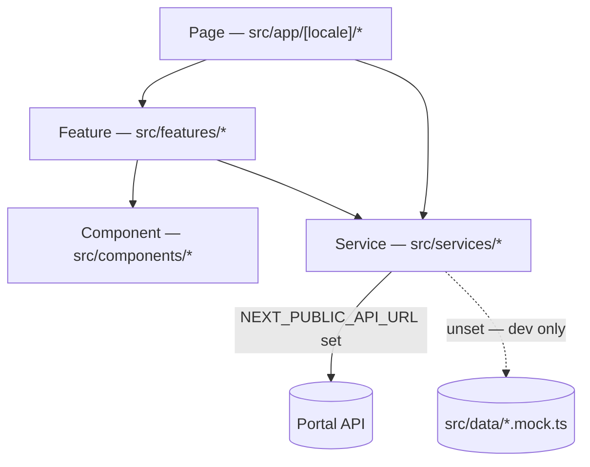

**Components never import from `src/data/`.** Everything reaches the UI through
the service layer, which is the single place the API is called. The mocks are a
*configuration* fallback so the site runs with no backend; once
`NEXT_PUBLIC_API_URL` is set a failed request throws, because silently serving
last year's events is worse than an error page.

Services: `announcements`, `blog`, `church`, `contact`, `downloads`, `events`, `fellowships`, `gallery`, `leadership`.

### The design system

| Concern | Where |
|---|---|
| Tokens — colour, type, spacing, radius, shadow, motion | `src/styles/globals.css` (`@theme`) |
| Semantic surfaces | `--background`, `--surface`, `--foreground`, `--primary`, `--sacred`, `--border` |
| Primitives | `Button`, `Card`, `Section`, `Container`, `Badge`, `Input`, `Dialog`, `Typography` |
| Motion | `Reveal`, `Stagger`, `Parallax` — all honour `prefers-reduced-motion` |

The palette is sampled from the parish seal: the magenta of the cross
(`brand`) and the orange of the flame (`accent`), with `crimson` seated between
them for sacred marks, over a warm parchment neutral. Values are in **OKLCH** so
light/dark pairs stay perceptually even.

### Bilingual rules

| | |
|---|---|
| **UI chrome** | `src/messages/{en,ta}.json`, via `useTranslations()` |
| **Content** | `LocalizedText = { en, ta }` per record, via `localize()` |

Tamil is not a translation layer bolted on: `globals.css` carries a Tamil metric
scale (larger glyphs, longer words, no capital forms), so headings, nav labels
and the wordmark all step down on small screens under `html[lang="ta"]`.

---

## The mobile CMS — `stmarks_portal_app`

Flutter, package `csi_portal`. The Portal's CMS as a phone app, against the same
API. State with Riverpod, routing with `go_router`, HTTP with `dio`, and the API
base URL entered at runtime rather than compiled in.

Feature areas (18): `announcements`, `audit`, `auth`, `backup`, `blog`, `church`, `connect`, `contact`, `dashboard`, `downloads`, `events`, `fellowships`, `gallery`, `media`, `roles`, `settings`, `shell`, `users`.

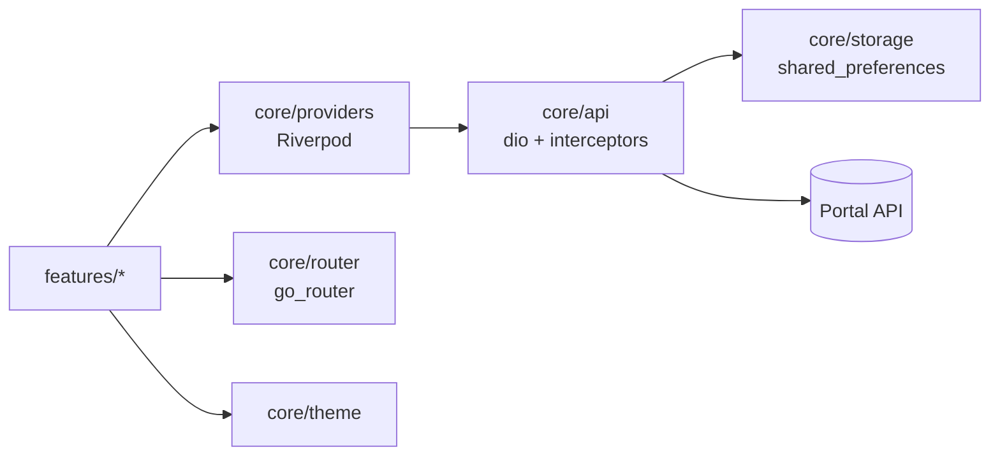

> **Three clients, one contract.** A breaking API change now breaks the website,
> the web CMS and this app. `Portal/scripts/` checks contract parity for the two
> TypeScript clients; the Dart models are **not** in that check, and adding them
> is the obvious next step.

---

## Terms of use

*Template wording for the public site. It has **not** been reviewed by a lawyer;
have the church's own advisor read it before publishing.*

### 1. Who runs this site

This website is operated by **CSI St. Mark's Church, Madipakkam**, a
congregation of the Church of South India. Contact details are on the Contact
page.

### 2. Using the site

The site is provided for information about the church, its services, its
fellowships and its activities. You may read, print and share its pages for
personal, non-commercial purposes.

You may not: present the site or its contents as your own; use it to
misrepresent the church; attempt to gain unauthorised access to any part of it;
or use automated tools in a way that degrades it for others.

### 3. Accuracy

Service times, events and announcements are published in good faith and kept as
current as the church office is able. **Times and dates can change at short
notice** — for anything you are travelling for, please confirm with the church.

### 4. Photographs and copyright

Photographs, text, the parish crest and the diocese arms are the property of the
church or used with permission. The crest and arms are marks of the church and
of the Church of South India and may not be reused without written permission.

**If you appear in a photograph and would like it removed, contact the church
office and it will be taken down.** No explanation is required.

### 5. External links

The site links to the diocese and to social media accounts. The church is not
responsible for the content of any site it links to.

### 6. Availability

The site is offered as-is. The church does not guarantee uninterrupted
availability and is not liable for loss arising from its use or unavailability.

---

## Privacy notice

*Template wording. Have it reviewed before publishing.*

### What is collected

| Where | What | Why |
|---|---|---|
| **Contact form** | Name, email, phone (if given), your message | To reply to you |
| **Server logs** | IP address, browser, pages requested | Security and diagnosis |
| **Portal accounts** | Name, email, role | To operate the CMS |

**No advertising or analytics trackers are used, and no cookies are set for
tracking.** The site stores no personal data in your browser beyond the language
you have chosen.

### Contact form messages

Messages are stored in the church's own database and read by authorised staff.
They are not sold, shared or used for mailings. Ask the office and a message
will be deleted.

### Children

Photographs of children are published **only with the consent of a parent or
guardian**. Consent can be withdrawn at any time by contacting the office.

### Your rights

You may ask what is held about you, ask for it to be corrected, or ask for it to
be deleted. Requests go to the church office.

### Where the data lives

On infrastructure the church controls. Backups contain the same data and are
held with the same care.

---

## Accessibility statement

The site aims to meet **WCAG 2.1 Level AA**.

| | |
|---|---|
| **Contrast** | Every colour pairing measured; all pass AA, in all eight liturgical seasons. Lowest reading in the year: 7.9:1 |
| **Keyboard** | Every control reachable and operable; visible focus on all of them |
| **Structure** | Semantic landmarks, one `h1` per page, ordered headings |
| **Images** | Alt text on content images; decorative artwork `aria-hidden` |
| **Motion** | Everything honours `prefers-reduced-motion` — snow, ornaments and drift stop or disappear |
| **Targets** | Interactive controls at least 44×44px |
| **Language** | `lang` set per locale; Tamil carries its own metric scale |
| **Zoom** | Usable to 200% without horizontal scrolling |

**Known limits.** The home page opens with a scroll-driven cinematic sequence;
it is decorative and every page is fully readable without it. The seasonal
decoration is `aria-hidden` throughout and conveys nothing not also in text.

To report a barrier, contact the church office — it will be treated as a bug.

---

## Getting started

Prerequisites: **Node.js ≥ 20**, and MongoDB — either running locally or
reachable by URI.

### 1. The Portal (API + CMS)

```bash
cd Portal
npm install
cp backend/.env.example backend/.env      # then edit — see below
cp frontend/.env.example frontend/.env.local

npm run seed        # creates the seed admin from SEED_ADMIN_* in backend/.env
npm run dev         # API :4000 and CMS :3001 together
```

Verify: `curl http://localhost:4000/v1/health`, then sign in at
`http://localhost:3001`.

### 2. The public website

```bash
cd WebsiteRT
npm install
npm run dev         # :3000
```

**The website runs with no backend.** With `NEXT_PUBLIC_API_URL` unset, every
service resolves from `src/data/*.mock.ts` and the whole site renders — which is
how the frontend is developed independently. To point it at a live Portal, set:

```dotenv
NEXT_PUBLIC_API_URL=http://localhost:4000/v1
```

> Set that variable and the Portal **must** be running. The fallback is
> configuration-driven only: once a URL is configured, a connection failure
> throws `TypeError: fetch failed` rather than quietly reverting to fixtures.
> If every page errors with `ECONNREFUSED`, the API is down — comment the
> variable out to keep working on the frontend.

### Useful scripts

| Where | Command | Purpose |
|---|---|---|
| `Portal` | `npm run verify` | build + typecheck + test |
| `Portal` | `npm run check:contract` | API/contract parity |
| `Portal` | `npm run build:bundle` | packaged production bundle |
| `Portal` | `npm run export:demo-data` | export content as a snapshot |
| `WebsiteRT` | `npm run build` | production build, prerenders 85 pages |
| `WebsiteRT` | `npm run dev:fresh` | reap dev workers, clear `.next`, start |
| `WebsiteRT` | `npm run clean` | delete the build cache |

`WebsiteRT` has a `predev` hook that reaps orphaned dev workers — `.next` was
measured at 2.6 GB after a dev-worker storm, and a corrupt dev cache is the
usual reason a fresh `next dev` crash-loops.

---

## Environment variables

### `Portal/backend/.env`

| Variable | Purpose | Notes |
|---|---|---|
| `PORT` | API port | default `4000` |
| `API_PREFIX` | Route prefix | default `v1` |
| `PUBLIC_URL` | Public origin of the API | builds absolute media URLs |
| `CORS_ORIGINS` | Comma-separated allowed origins | CMS, then the website |
| `MONGODB_URI` | Connection string | **secret** |
| `JWT_ACCESS_SECRET` | Access token signing key | **secret**, **min 32 chars** |
| `JWT_ACCESS_EXPIRES` | Access lifetime | default `15m` |
| `JWT_REFRESH_SECRET` | Refresh token signing key | **secret**, **min 32 chars** |
| `JWT_REFRESH_EXPIRES` | Refresh lifetime | default `7d` |
| `SEED_ADMIN_EMAIL` / `_NAME` / `_PASSWORD` | First admin, used by `npm run seed` | password is **secret** |
| `UPLOAD_DIR` | Media root on disk | |
| `MAX_UPLOAD_MB` | Upload size cap | |
| `MAX_BACKUP_UPLOAD_MB` | Cap on an uploaded restore archive | default `4096` |
| `MAX_BACKUP_EXPANDED_MB` | Cap on what that archive may expand to | default `16384`; guards against a zip bomb filling the database's disk |
| `TRUST_PROXY` | Whether `X-Forwarded-For` is believed | `false` here, `loopback` in the container. Sets `req.ip`, which the rate limiter and audit log depend on |
| `BACKUP_WORK_DIR` | Where archives are built and uploads land | default `<tmp>/csistmc-portal-backup`; point at a volume if `/tmp` is small |
| `WEBSITE_REVALIDATE_URL` | Website's revalidation endpoint | e.g. `https://…/api/revalidate` |
| `WEBSITE_REVALIDATE_SECRET` | Shared secret for it | **secret**, must match the website |

The 32-character minimum on the JWT secrets is enforced at boot, and the API
refuses to start rather than run on a weak key. A container that boot-loops on
first deploy is usually this.

### `WebsiteRT/.env.local`

| Variable | Purpose |
|---|---|
| `NEXT_PUBLIC_API_URL` | Portal API base, e.g. `http://localhost:4000/v1`. **Unset ⇒ fixtures.** |
| `NEXT_PUBLIC_SITE_URL` | Canonical origin for SEO, sitemap and OG tags |
| `REVALIDATE_SECRET` | Must equal the Portal's `WEBSITE_REVALIDATE_SECRET` |

Never commit a real value for any row marked **secret**. `.env*` files are
git-ignored; `.env.example` files are the contract and are tracked.

---

## Deployment

### Single container (recommended)

The Portal ships as one image containing the API, the CMS, MongoDB and a content
snapshot.

**ZimaOS / CasaOS** — import `Portal-Docker/docker-compose.zimaos.yml`. Log in
to the registry first (`docker login -u stmarksdev`); the image is private. Use
that file rather than `docker-compose.deploy.yml`, which is written for the
`docker compose` CLI and imports badly.

**Any other Docker host:**

```bash
cd Portal-Docker
docker compose -f docker-compose.deploy.yml up -d
```

Then open `http://<host>:8080` for the CMS; the API is at
`http://<host>:8080/v1`.

Persist both volumes:

| Mount | Holds | If you lose it |
|---|---|---|
| `/data` | MongoDB data **and the secrets generated on first boot** | resets to the shipped snapshot on restart |
| `/app/backend/uploads` | Media uploaded through the CMS | uploaded media is gone |

Give first boot time: it restores 567 documents and 261 media files before
anything listens, which is why the healthcheck allows a 120-second start period.

See `Portal-Docker/DEPLOY-AND-TEST.md` and `Portal-Docker/PUSH.md` for building
and publishing the image.

### The website

`WebsiteRT` is a standard Next.js app — any Node host or Vercel. Set
`NEXT_PUBLIC_API_URL`, `NEXT_PUBLIC_SITE_URL` and `REVALIDATE_SECRET`, then add
the site's `/api/revalidate` URL and the same secret to the Portal's
`WEBSITE_REVALIDATE_URL` / `WEBSITE_REVALIDATE_SECRET` so publishing invalidates
the cache.

---

## Backup and restore

**Backup & restore** in the CMS (`/backup`) produces one zip file holding the
entire installation, and takes one back.

```
manifest.json           what was captured, when, from where, by whom
db/<collection>.json    every collection, canonical Extended JSON
uploads/<path>          every file in the media library
```

Nothing is filtered and `_id` is preserved, because this is a **clone rather
than an export**: documents reference each other by id — a gallery album's cover
is a `media` record, a contact message belongs to a user — and dropping ids would
sever every one of those. That also means the archive contains admin accounts,
password hashes and the contact inbox. It is the database. Store it accordingly.

Extended JSON rather than plain JSON for the same reason
`Portal-Docker/scripts/capture-live-data.mjs` uses it: `JSON.stringify` flattens
a `Date` and an `ObjectId` to indistinguishable strings, and every query that
filters on a date or joins on an id would then quietly match nothing.

Media URLs are stored absolute — the Website reads the API cross-origin and
cannot resolve a relative path against its own domain — so they are rewritten to
the token `{{MEDIA}}/…` on the way out and to this installation's own origin on
the way in. A backup taken from a LAN address restores correctly onto a domain.

### Restoring

Uploading and applying are **two separate steps**. The upload is inspected and
held; the CMS shows the manifest — when the backup was taken, from which
installation, how much of it there is, and what will be overwritten — and only
then offers the button. A restore cannot be undone, and uploading the file twice
to confirm is not a kindness on a church office's connection.

| Mode | Database | Media |
|---|---|---|
| `replace` | Empties each collection in the archive, then inserts. A true rollback — anything created since the backup is gone. | Overwrites existing files. |
| `merge` | Upserts by `_id`. Deletes nothing; records deleted since stay deleted. | Leaves existing files alone. |

Media is written before the database. A run that dies between the two leaves
files nothing references, which is harmless; the reverse is a site full of
broken pictures.

By default a **safety backup** of the current data is taken first and its
download link returned with the result. Its link carries its own token, so it
still works even when the restore has just replaced the account that asked for
it — which a `replace` restore of the `users` collection does.

### Who can do it

| Permission | Roles | |
|---|---|---|
| `backup.read` | super-admin | Build and download an archive. |
| `backup.restore` | super-admin | Upload and apply one. |

**Super-admin only, both halves** — the only feature in the CMS an `admin` cannot
touch at all. Downloading is held as high as restoring on purpose: the archive is
the whole database in one portable file, so taking one hands over every password
hash in the installation whether or not you can put one back. And a restore
rewrites the user table, so whoever can run one can give themselves any account
in the archive.

The download itself is served on an unguessable 256-bit token rather than a
Bearer header, because a browser download is a navigation and cannot carry one.
The token is checked in constant time, refers to a single archive, and expires
with it after thirty minutes.

---

## Security

### Before the first push — read this

This repository had **two files that would have committed live credentials**:

```
Portal/backend/.env.bak-2026-07-27T07-50-55-182Z
Portal-Docker/backend/.env.bak-2026-07-27T07-50-55-182Z
```

Each contains a populated `MONGODB_URI` **including its password**, both JWT
signing secrets, the seed admin password, and the website revalidation secret.
The per-project `.gitignore` files list `.env`, `.env.local` and `.env.*.local`
— **none of which match `.env.bak-…`**. The root `.gitignore` added here covers
them, and `git add -An` now stages no environment file except `*.example`.

**The ignore rule stops the leak; it does not undo one.** Because those secrets
have existed in a working tree on disk, treat them as exposed and rotate before
going public:

1. The MongoDB user's password, and `MONGODB_URI` with it.
2. `JWT_ACCESS_SECRET` and `JWT_REFRESH_SECRET` — rotating these invalidates all
   sessions, which is the point.
3. The seed admin password, and any account created from it.
4. `WEBSITE_REVALIDATE_SECRET` — in the Portal **and** the website, together.

Then delete the two `.bak` files; they are backups of a file you still have.

If anything was already pushed, a new commit does **not** remove it — history
needs rewriting (`git filter-repo`) *and* every secret rotating, because the
objects stay reachable through forks, caches and clones.

### Ongoing

- Never commit `.env`; keep `.env.example` current instead.
- `Portal/dist-portal.zip` (51 MB) and `dist-portal/` (124 MB, 12,354 files) are
  build output and are ignored — the zip exceeds GitHub's 50 MB warning
  threshold, and history cannot be pruned without a rewrite. Rebuild with
  `npm run build:bundle`.
- Rotate the JWT secrets on any suspected compromise; it forces re-login
  everywhere.
- Audit logs are append-only and only `super-admin` can purge them. Keep it that
  way — the deletion permission exists to be withheld.
- `~25 MB` of seed media is duplicated between `Portal/backend/seed-assets` and
  `Portal-Docker/{snapshot,backend/seed-assets}`. It is tracked deliberately
  (first boot needs it), but it is a candidate for Git LFS.

### What the application defends against

Reviewed across both halves; each item below is enforced in code and, where the
failure would be silent, covered by a check in `backend/scripts/smoke-test.js`.

**Uploads cannot become code.** The stored filename comes from the *validated*
MIME type (`EXTENSION_FOR_MIME`), never from the name the browser sent, and an
image must actually decode before it is written. Previously the two were
independent — only the declared type was checked, while the extension came from
the filename — so `payload.html` declared `image/png` was stored under
`uploads/images/` and served back as `text/html`. On the single-container
deployment the CMS and the API share one origin, which made that a script on the
CMS's own origin, and access tokens live in `localStorage`.

**Search terms are literals.** Every `$regex` filter escapes its input.
Unescaped, `(` is a driver syntax error surfaced as a 500, and `(a+)+$` is
catastrophic backtracking inside the database — a denial of service available to
any `content.read` holder, which includes `viewer`.

**Rate limits are per client.** `TRUST_PROXY` decides what `req.ip` resolves to;
the container's router sets `X-Forwarded-For` and the image trusts one loopback
hop, while the plain deployment trusts nothing. Left unset behind a proxy, every
caller shared one bucket — one attacker could exhaust the sign-in limit for the
whole parish — and every audit entry recorded the proxy rather than a person.

**Sign-in tells you nothing.** Identical message and, since an unknown address
is compared against a decoy hash, identical timing. Passwords are bcrypt, floor
12 everywhere (the administrator-set path was 8), and bounded at 200 characters
so an unauthenticated request cannot spend the server's CPU.

**Restores cannot escape their directory.** Archive entry names are rejected for
absolute paths, drive letters, `..` segments and control characters, and the
resolved path is then checked to fall inside the upload root — two independent
gates. An archive is refused if its declared expansion exceeds
`MAX_BACKUP_EXPANDED_MB`, checked before anything is written.

**The CMS cannot be framed.** `X-Frame-Options: DENY` and
`frame-ancestors 'none'`, plus `nosniff` and a referrer policy. Next sets none
of these itself, and the API's `helmet` does not cover the CMS — they are
separate servers.

### Known residual risks

Stated rather than quietly carried:

- **Tokens live in `localStorage`.** Any future XSS in the CMS therefore yields
  a session. The editor escapes before writing `innerHTML` and no other
  injection sink was found, but `httpOnly` cookies would make the class of bug
  survivable rather than fatal. Changing it means CSRF protection, which the
  Bearer scheme currently makes unnecessary.
- **No account lockout**, only rate limiting. Adequate against one host; a
  distributed guesser is bounded only by the 12-character floor.
- **A hostile archive may under-declare its expanded size.** The pre-flight
  ceiling catches the accident; a lying header ends at the real disk. Only a
  super-admin can restore, and they can already replace the whole database.
- **No CSP on the CMS beyond `frame-ancestors`.** Next inlines its hydration
  scripts, so a policy worth having needs nonces threaded through the app.

---

## Conventions

- **TypeScript everywhere**, with `@portal/shared` as the single source for
  types, enums and the permission matrix. Change a content shape there first.
- **Bilingual by construction.** Every visible string is `LocalizedText`
  requiring both `en` and `ta`. Do not add a bare `string` for display text.
- **Slugs are the public identity.** URLs, cross-references and cache tags all
  key off slugs, not `_id`.
- **Publishing is a permissioned transition**, not a field write.
- **Next.js version.** Both websites and the CMS pin a Next.js newer than most
  documentation online — middleware is `src/proxy.ts` here, for instance. Each
  project's `AGENTS.md` says it plainly: consult
  `node_modules/next/dist/docs/` before writing Next-specific code.
- **Cache tags** are the seven in `WebsiteRT/src/app/api/revalidate/route.ts`:
  `events`, `blog`, `gallery`, `announcements`, `downloads`, `fellowships`,
  `church`. A new content type needs a tag here and a call from the Portal.

### Suggested first commit

```bash
git add .
git status                      # confirm no .env, no dist-portal, no *.zip
git commit -m "Initial commit: Portal (CMS + API) and public website"
git branch -M main
git remote add origin git@github.com:<owner>/<repo>.git
git push -u origin main
```

The current branch is `master` with no commits; `git branch -M main` renames it
before the first push.

---

## Licence

No licence file is present. Until one is added the default applies — all rights
reserved, and no permission is granted to use, copy or distribute this code.
Add a `LICENSE` before making the repository public if that is not the intent.
