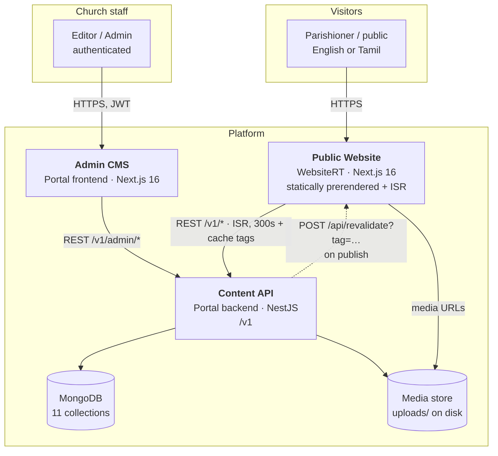
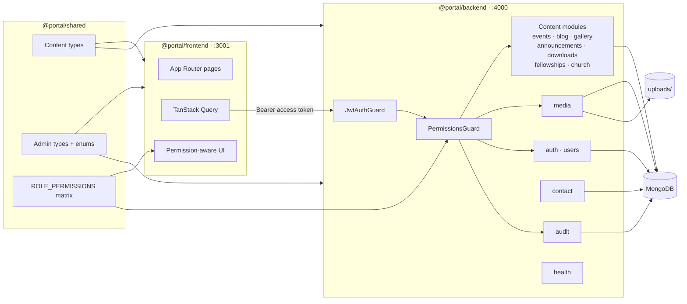
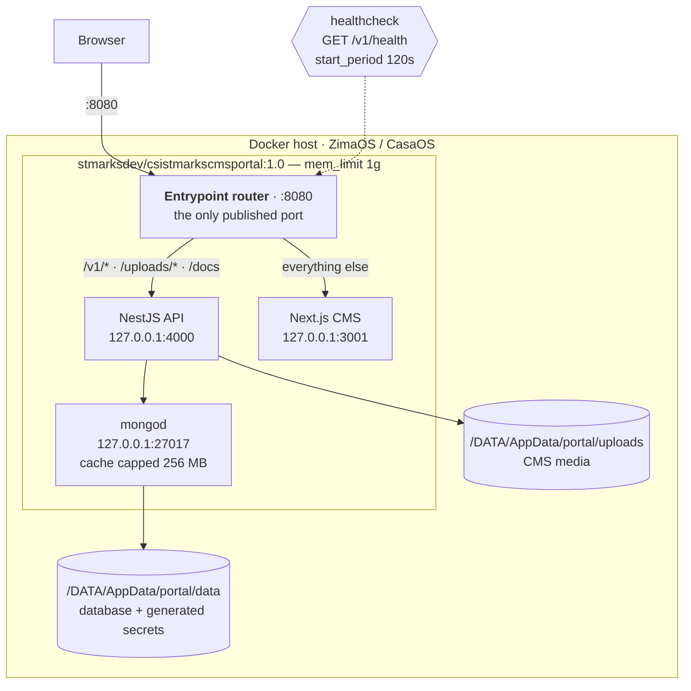
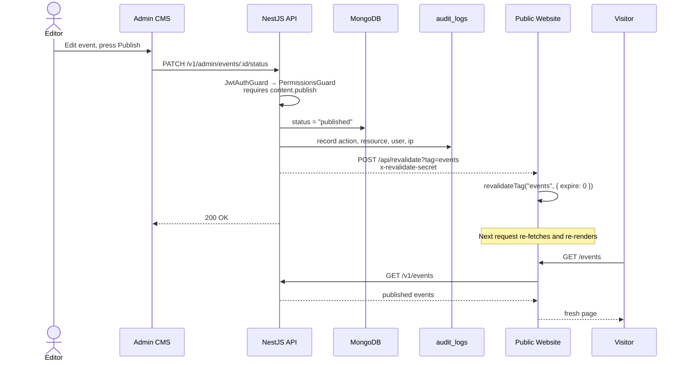
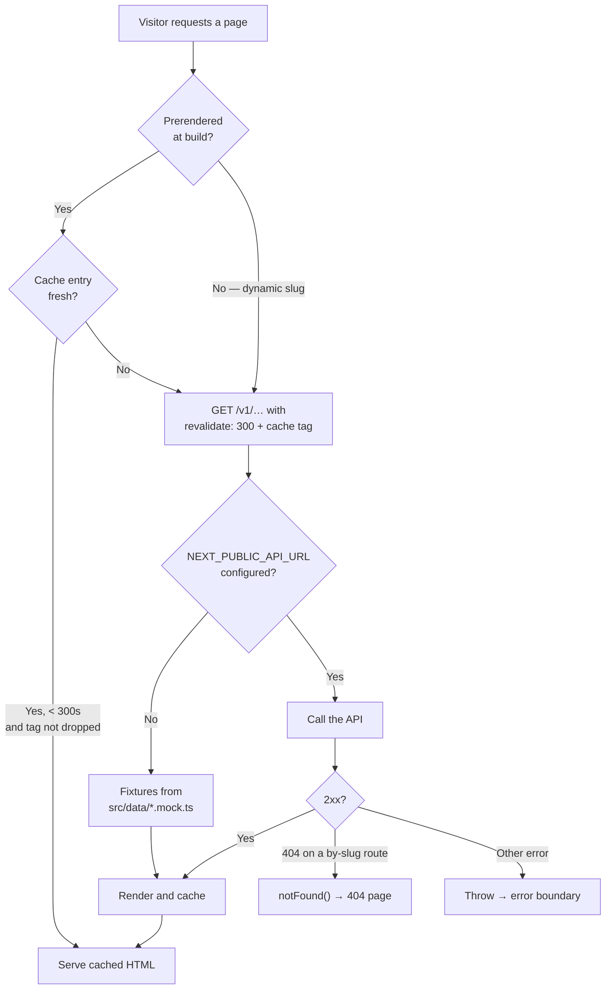
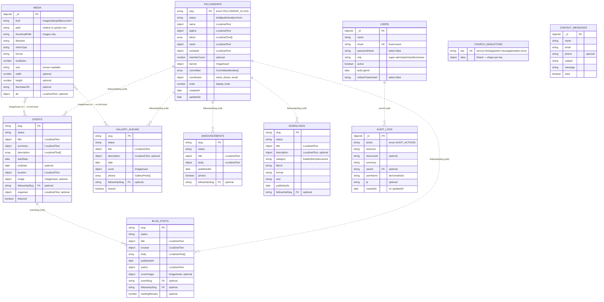
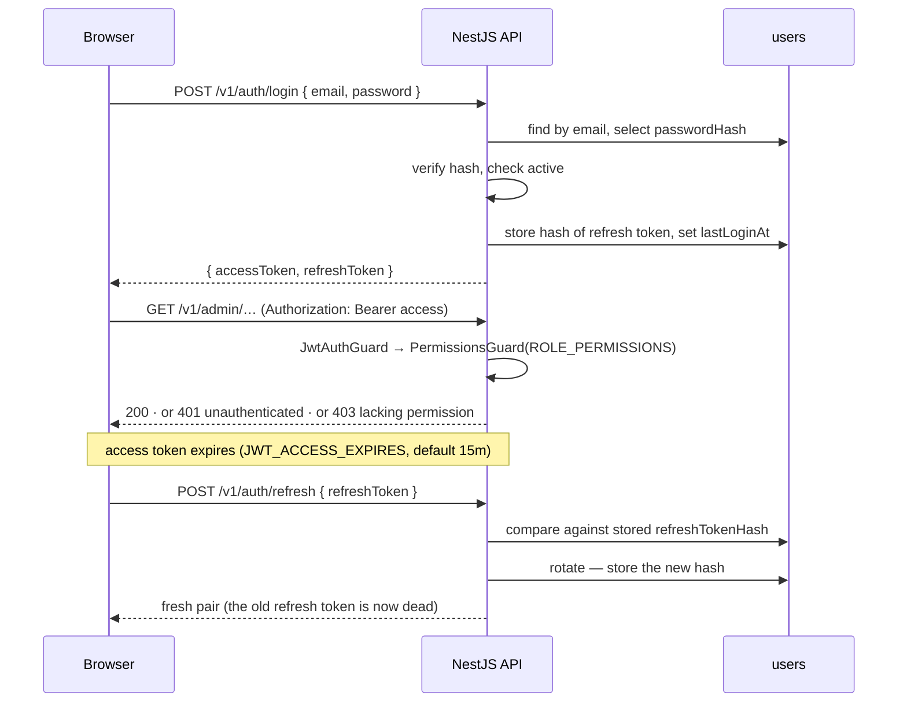

# CSI St. Mark's Church, Madipakkam — Website & Portal

The complete web platform for CSI St. Mark's Church, Madipakkam: a bilingual
(English / Tamil) public website, and the admin CMS and content API that feed it.

| | |
|---|---|
| **Public website** | Next.js 16 (App Router), React 19, Tailwind CSS 4, `next-intl` |
| **Admin CMS** | Next.js 16, TanStack Query, Radix UI, `react-hook-form` |
| **API** | NestJS, MongoDB (Mongoose), JWT auth with refresh rotation |
| **Language** | TypeScript throughout, with a shared contract package |
| **Runtime** | Node.js ≥ 20 |
| **Deployment** | Single Docker image (API + CMS + MongoDB), ZimaOS / CasaOS or any Docker host |

---

## Table of contents

- [Repository layout](#repository-layout)
- [Architecture](#architecture)
  - [System context](#system-context)
  - [Portal internals](#portal-internals)
  - [Deployment topology](#deployment-topology)
  - [Publish-to-live sequence](#publish-to-live-sequence)
  - [Request paths](#request-paths)
- [Data model](#data-model)
  - [ER diagram](#er-diagram)
  - [Collections](#collections)
  - [Embedded types](#embedded-types)
  - [Enumerations](#enumerations)
- [Authentication and authorisation](#authentication-and-authorisation)
- [API surface](#api-surface)
- [Getting started](#getting-started)
- [Environment variables](#environment-variables)
- [Deployment](#deployment)
- [Security](#security)
- [Conventions](#conventions)

---

## Repository layout

Four top-level projects. They are **not** a single npm workspace — each is
installed and built on its own.

```
.
├── Portal/          Admin CMS + content API   (npm workspaces monorepo)
│   ├── shared/      @portal/shared — types, enums, role→permission matrix
│   ├── backend/     @portal/backend — NestJS REST API      :4000  /v1
│   ├── frontend/    @portal/frontend — Next.js admin CMS   :3001
│   ├── docs/        API contract and design notes
│   └── scripts/     contract parity, Postman export, bundle build
│
├── Portal-Docker/   The same Portal, packaged as ONE Docker image
│   ├── docker/      entrypoint router, snapshot restore, launch
│   ├── snapshot/    shipped content, media and accounts for first boot
│   └── docker-compose.zimaos.yml   ← import this on ZimaOS / CasaOS
│
├── WebsiteRT/       Public website — ACTIVE
└── Website/         Public website — earlier iteration, superseded
```

### On the duplicated projects

Two pairs look redundant and are not quite:

**`Portal/` and `Portal-Docker/`** share the same application source but differ
in about 25 files, all of them about *how it is hosted*: `main.ts`,
`configure-app.ts`, `app.module.ts`, production config validation, a request
interceptor, and the whole `docker/` directory. `Portal/` is what you develop
against — two servers, your own MongoDB. `Portal-Docker/` is what ships — one
container that brings its own database and content.

**`WebsiteRT/` and `Website/`** are two iterations of the public site.
**`WebsiteRT/` is current**; `Website/` predates it by 42 differing or unique
files and is kept for reference.

> If you are starting work: **`Portal/`** and **`WebsiteRT/`**.
>
> Carrying two near-copies of each is a real maintenance cost — a fix to a
> content schema has to be applied in both Portal trees. Consolidating
> `Portal-Docker/` into a build target of `Portal/`, and retiring `Website/`,
> is the obvious next structural cleanup. It is deliberately **not** done here,
> because it is a judgement call about the project's direction rather than a
> documentation task.

---

## Architecture

### System context



Two properties are worth naming, because most of the design follows from them:

1. **The website never talks to the database.** It reads the same public REST
   contract any other client would. That is why it can fall back to fixture
   data and still render (see [Getting started](#getting-started)).
2. **Publishing is push, not poll.** The API tells the website which content
   changed; the website drops exactly those cache tags. Without this, an edit
   takes up to five minutes to appear and — worse — an index page and a detail
   page can disagree about the same record in the meantime.

### Portal internals



`@portal/shared` is the reason the CMS and the API cannot drift: the publish
statuses, the media kinds, the fellowship slugs and the **role→permission matrix
are declared once** and imported by both. The backend guard and the frontend's
"can this user see this button" check read the same object.

### Deployment topology

Production is a **single container**. One image holds the API, the CMS, a
`mongod`, and a snapshot of the church's content — so a parish with no
infrastructure can run it, and losing the volume is the only way to lose data.



Three things in that diagram are load-bearing, and each exists because of a
failure that actually happened:

- **The API and CMS bind to loopback**, not `0.0.0.0`. Only the router is
  published, so the two servers share one origin and the CMS's API calls are
  same-origin. (`SPLIT_PORTS=true` exposes them separately, and then
  `NEXT_PUBLIC_API_URL` must be set too.)
- **No `environment:` block in the ZimaOS compose.** Its importer does not
  expand `${VAR}` syntax — it stores the text literally, so a defaulted
  `JWT_ACCESS_SECRET` arrives as a 22-character string, the API refuses to start
  on a secret under 32 characters, and the container boot-loops with no visible
  cause. The container generates real secrets into its volume on first boot
  instead.
- **`start_period: 120s`.** First boot restores 567 documents and 261 media
  files before anything listens. A shorter grace period makes the orchestrator
  restart a container that is doing exactly what it was told to.

### Publish-to-live sequence



`{ expire: 0 }` rather than `"max"` is deliberate. `"max"` marks the tag stale
and serves stale-while-revalidate, so the **first** visitor after a publish still
gets the old content — including the editor who just pressed Publish and
reloaded to check. They would reasonably conclude it had not worked.

### Request paths



The fallback is **configuration-driven only**. With `NEXT_PUBLIC_API_URL` unset
the site renders from fixtures; once it is set, a failing request throws rather
than silently serving fixtures — because a page quietly showing last year's
service times is worse than one that errors.

---

## Data model

MongoDB, 11 collections, accessed through Mongoose schemas in
`Portal/backend/src/modules/*/schemas/`.

### Read this before reading the diagram

**There are no `ObjectId` references anywhere in the content model.** Documents
are joined by **slug strings**, and MongoDB enforces none of it. The diagram
below draws those as relationships because that is what they mean, but they are
application-level conventions:

- Cross-collection slug fields (`fellowshipSlug`, `eventSlug`) are validated
  against a TypeScript enum on write, not against the target collection. A
  `fellowshipSlug` can name a fellowship that does not exist yet.
- Deletes do not cascade. Removing a fellowship leaves every event, album and
  download pointing at a slug with nothing behind it.
- `ImageAsset.url` is a plain string. Nothing links a piece of content to the
  `media` document its image came from, so the media library cannot tell you
  what is using a file.

Those are the three things to keep in mind when changing this schema.

### ER diagram



`..` is used throughout instead of `--` as a reminder that **none of these are
enforced by the database.**

### Collections

| Collection | Purpose | Identity | Workflow |
|---|---|---|---|
| `fellowships` | The eight parish fellowships | `slug` (fixed enum) | defaults to `published` |
| `events` | Church events | `slug` | `draft` → publish |
| `blog_posts` | Articles, optionally tied to an event | `slug` | `draft` → publish |
| `gallery_albums` | Photo albums with embedded photos and videos | `slug` | `draft` → publish |
| `announcements` | Notices, pinnable | `slug` | `draft` → publish |
| `downloads` | Bulletins, forms, documents | `slug` | `draft` → publish |
| `media` | Upload library — images, video, PDF, documents | `_id` | n/a |
| `users` | CMS accounts | `email` unique | `active` flag |
| `audit_logs` | Who changed what, append-only | `_id` | `createdAt` only |
| `church_singletons` | Service timings, pastor's message, weekly verse | `key` unique | overwrite |
| `contact_messages` | Website contact form submissions | `_id` | `read` flag |

`church_singletons` is a key/value table with a `Mixed` payload — three fixed
keys, each with its own shape. It trades schema enforcement for not needing
three collections and three modules to hold one document each.

### Embedded types

Defined in `Portal/backend/src/common/schemas/sub-schemas.ts` and mirrored in
`@portal/shared`:

| Type | Shape | Notes |
|---|---|---|
| `LocalizedText` | `{ en, ta }` | **Both required**, default `""`. Every visible string. |
| `ImageAsset` | `{ url, alt: LocalizedText, width, height }` | Dimensions required — the website needs them to reserve space and avoid layout shift. |
| `GalleryPhoto` | `{ id, image, caption?, video? }` | Embedded in an album. |
| `GalleryVideo` | `{ url, provider: file\|youtube\|vimeo }` | A gallery item can be a video. |
| `CommitteeMember` | `{ id, name, designation, image? }` | Embedded in a fellowship. |
| `Coordinator` | `{ name, phone?, email? }` | One per fellowship. |

Bilingual content is structural, not an afterthought: `LocalizedText` requires
**both** `en` and `ta`, so a half-translated record is representable but visible
as an empty string rather than a missing key.

### Enumerations

Single-sourced in `@portal/shared`, so the API guard, the CMS UI and the
website's types cannot disagree.

```
PUBLISH_STATUSES     draft · published · archived
USER_ROLES           super-admin · admin · editor · viewer
MEDIA_KINDS          image · video · pdf · document
DOWNLOAD_CATEGORIES  bulletin · form · document
SINGLETON_KEYS       service-timings · pastor-message · weekly-verse
FELLOWSHIP_SLUGS     youth-fellowship · young-couple-fellowship · sunday-school
                     choir · womens-fellowship · mens-fellowship
                     prayer-fellowship · other-fellowships
```

---

## Authentication and authorisation



Two deliberate choices:

- **Refresh tokens are rotated and stored as a hash.** One `refreshTokenHash`
  per user, replaced on every refresh, so a stolen refresh token stops working
  the moment the real user refreshes — and `POST /v1/auth/logout` clears it,
  which makes logout server-side rather than a client discarding a string.
- **`passwordHash` and `refreshTokenHash` are `select: false`.** They are not
  returned unless explicitly asked for, so a careless `findOne().lean()` in a
  new endpoint cannot leak them.

### Role → permission matrix

Declared once in `Portal/shared/src/admin.ts` as `ROLE_PERMISSIONS`.

| Permission | super-admin | admin | editor | viewer |
|---|:--:|:--:|:--:|:--:|
| `content.read` | ✅ | ✅ | ✅ | ✅ |
| `content.write` | ✅ | ✅ | ✅ | — |
| `content.publish` | ✅ | ✅ | — | — |
| `content.delete` | ✅ | ✅ | — | — |
| `media.read` | ✅ | ✅ | ✅ | ✅ |
| `media.write` | ✅ | ✅ | ✅ | — |
| `media.delete` | ✅ | ✅ | — | — |
| `users.read` | ✅ | ✅ | — | — |
| `users.write` | ✅ | — | — | — |
| `audit.read` | ✅ | ✅ | — | — |
| `audit.delete` | ✅ | — | — | — |
| `settings.write` | ✅ | ✅ | — | — |
| `contact.read` | ✅ | ✅ | — | — |

Read the file rather than this table if the two ever disagree — the file is what
the guard executes. Note the two super-admin-only powers: creating users, and
purging audit history (which erases the record of who did what).

---

## API surface

Base URL `\<host\>/v1`. OpenAPI/Swagger is served by the API; health is
`GET /v1/health`.

**Public** — no auth, published content only:

```
GET  /v1/events                    GET  /v1/announcements
GET  /v1/events/:slug              GET  /v1/announcements/pinned
GET  /v1/blog                      GET  /v1/downloads
GET  /v1/blog/slugs                GET  /v1/downloads/grouped
GET  /v1/blog/:slug                GET  /v1/fellowships
GET  /v1/gallery                   GET  /v1/church/service-timings
GET  /v1/gallery/:slug             GET  /v1/church/pastor-message
POST /v1/contact                   GET  /v1/church/weekly-verse
```

**Admin** — `Authorization: Bearer …` plus the permission shown:

```
/v1/auth/login · refresh · logout · me · change-password
/v1/admin/events          GET · GET :id · POST · PATCH :id · PATCH :id/status · DELETE :id
/v1/admin/blog            same shape
/v1/admin/gallery         same shape
/v1/admin/downloads       same shape
/v1/admin/announcements   same shape, plus PATCH :id/pin
/v1/admin/fellowships     GET · PATCH
/v1/admin/church          GET/PUT service-timings · pastor-message · weekly-verse
/v1/admin/media           upload · list · delete
/v1/admin/users           CRUD                      (users.read / users.write)
/v1/admin/contact-messages GET · PATCH :id/read · DELETE :id   (contact.read)
/v1/admin/audit-logs      GET · DELETE              (audit.read / audit.delete)
```

The status transition is its own endpoint (`PATCH :id/status`) rather than a
field on the update body, so publishing is a separately permissioned action —
an `editor` can save a draft but cannot make it live.

Contract tooling in `Portal/`:

```bash
npm run check:contract   # asserts the API matches the documented contract
npm run postman          # regenerates a Postman collection
```

---

## Getting started

Prerequisites: **Node.js ≥ 20**, and MongoDB — either running locally or
reachable by URI.

### 1. The Portal (API + CMS)

```bash
cd Portal
npm install
cp backend/.env.example backend/.env      # then edit — see below
cp frontend/.env.example frontend/.env.local

npm run seed        # creates the seed admin from SEED_ADMIN_* in backend/.env
npm run dev         # API :4000 and CMS :3001 together
```

Verify: `curl http://localhost:4000/v1/health`, then sign in at
`http://localhost:3001`.

### 2. The public website

```bash
cd WebsiteRT
npm install
npm run dev         # :3000
```

**The website runs with no backend.** With `NEXT_PUBLIC_API_URL` unset, every
service resolves from `src/data/*.mock.ts` and the whole site renders — which is
how the frontend is developed independently. To point it at a live Portal, set:

```dotenv
NEXT_PUBLIC_API_URL=http://localhost:4000/v1
```

> Set that variable and the Portal **must** be running. The fallback is
> configuration-driven only: once a URL is configured, a connection failure
> throws `TypeError: fetch failed` rather than quietly reverting to fixtures.
> If every page errors with `ECONNREFUSED`, the API is down — comment the
> variable out to keep working on the frontend.

### Useful scripts

| Where | Command | Purpose |
|---|---|---|
| `Portal` | `npm run verify` | build + typecheck + test |
| `Portal` | `npm run check:contract` | API/contract parity |
| `Portal` | `npm run build:bundle` | packaged production bundle |
| `Portal` | `npm run export:demo-data` | export content as a snapshot |
| `WebsiteRT` | `npm run build` | production build, prerenders 85 pages |
| `WebsiteRT` | `npm run dev:fresh` | reap dev workers, clear `.next`, start |
| `WebsiteRT` | `npm run clean` | delete the build cache |

`WebsiteRT` has a `predev` hook that reaps orphaned dev workers — `.next` was
measured at 2.6 GB after a dev-worker storm, and a corrupt dev cache is the
usual reason a fresh `next dev` crash-loops.

---

## Environment variables

### `Portal/backend/.env`

| Variable | Purpose | Notes |
|---|---|---|
| `PORT` | API port | default `4000` |
| `API_PREFIX` | Route prefix | default `v1` |
| `PUBLIC_URL` | Public origin of the API | builds absolute media URLs |
| `CORS_ORIGINS` | Comma-separated allowed origins | CMS, then the website |
| `MONGODB_URI` | Connection string | **secret** |
| `JWT_ACCESS_SECRET` | Access token signing key | **secret**, **min 32 chars** |
| `JWT_ACCESS_EXPIRES` | Access lifetime | default `15m` |
| `JWT_REFRESH_SECRET` | Refresh token signing key | **secret**, **min 32 chars** |
| `JWT_REFRESH_EXPIRES` | Refresh lifetime | default `7d` |
| `SEED_ADMIN_EMAIL` / `_NAME` / `_PASSWORD` | First admin, used by `npm run seed` | password is **secret** |
| `UPLOAD_DIR` | Media root on disk | |
| `MAX_UPLOAD_MB` | Upload size cap | |
| `WEBSITE_REVALIDATE_URL` | Website's revalidation endpoint | e.g. `https://…/api/revalidate` |
| `WEBSITE_REVALIDATE_SECRET` | Shared secret for it | **secret**, must match the website |

The 32-character minimum on the JWT secrets is enforced at boot, and the API
refuses to start rather than run on a weak key. A container that boot-loops on
first deploy is usually this.

### `WebsiteRT/.env.local`

| Variable | Purpose |
|---|---|
| `NEXT_PUBLIC_API_URL` | Portal API base, e.g. `http://localhost:4000/v1`. **Unset ⇒ fixtures.** |
| `NEXT_PUBLIC_SITE_URL` | Canonical origin for SEO, sitemap and OG tags |
| `REVALIDATE_SECRET` | Must equal the Portal's `WEBSITE_REVALIDATE_SECRET` |

Never commit a real value for any row marked **secret**. `.env*` files are
git-ignored; `.env.example` files are the contract and are tracked.

---

## Deployment

### Single container (recommended)

The Portal ships as one image containing the API, the CMS, MongoDB and a content
snapshot.

**ZimaOS / CasaOS** — import `Portal-Docker/docker-compose.zimaos.yml`. Log in
to the registry first (`docker login -u stmarksdev`); the image is private. Use
that file rather than `docker-compose.deploy.yml`, which is written for the
`docker compose` CLI and imports badly.

**Any other Docker host:**

```bash
cd Portal-Docker
docker compose -f docker-compose.deploy.yml up -d
```

Then open `http://<host>:8080` for the CMS; the API is at
`http://<host>:8080/v1`.

Persist both volumes:

| Mount | Holds | If you lose it |
|---|---|---|
| `/data` | MongoDB data **and the secrets generated on first boot** | resets to the shipped snapshot on restart |
| `/app/backend/uploads` | Media uploaded through the CMS | uploaded media is gone |

Give first boot time: it restores 567 documents and 261 media files before
anything listens, which is why the healthcheck allows a 120-second start period.

See `Portal-Docker/DEPLOY-AND-TEST.md` and `Portal-Docker/PUSH.md` for building
and publishing the image.

### The website

`WebsiteRT` is a standard Next.js app — any Node host or Vercel. Set
`NEXT_PUBLIC_API_URL`, `NEXT_PUBLIC_SITE_URL` and `REVALIDATE_SECRET`, then add
the site's `/api/revalidate` URL and the same secret to the Portal's
`WEBSITE_REVALIDATE_URL` / `WEBSITE_REVALIDATE_SECRET` so publishing invalidates
the cache.

---

## Security

### Before the first push — read this

This repository had **two files that would have committed live credentials**:

```
Portal/backend/.env.bak-2026-07-27T07-50-55-182Z
Portal-Docker/backend/.env.bak-2026-07-27T07-50-55-182Z
```

Each contains a populated `MONGODB_URI` **including its password**, both JWT
signing secrets, the seed admin password, and the website revalidation secret.
The per-project `.gitignore` files list `.env`, `.env.local` and `.env.*.local`
— **none of which match `.env.bak-…`**. The root `.gitignore` added here covers
them, and `git add -An` now stages no environment file except `*.example`.

**The ignore rule stops the leak; it does not undo one.** Because those secrets
have existed in a working tree on disk, treat them as exposed and rotate before
going public:

1. The MongoDB user's password, and `MONGODB_URI` with it.
2. `JWT_ACCESS_SECRET` and `JWT_REFRESH_SECRET` — rotating these invalidates all
   sessions, which is the point.
3. The seed admin password, and any account created from it.
4. `WEBSITE_REVALIDATE_SECRET` — in the Portal **and** the website, together.

Then delete the two `.bak` files; they are backups of a file you still have.

If anything was already pushed, a new commit does **not** remove it — history
needs rewriting (`git filter-repo`) *and* every secret rotating, because the
objects stay reachable through forks, caches and clones.

### Ongoing

- Never commit `.env`; keep `.env.example` current instead.
- `Portal/dist-portal.zip` (51 MB) and `dist-portal/` (124 MB, 12,354 files) are
  build output and are ignored — the zip exceeds GitHub's 50 MB warning
  threshold, and history cannot be pruned without a rewrite. Rebuild with
  `npm run build:bundle`.
- Rotate the JWT secrets on any suspected compromise; it forces re-login
  everywhere.
- Audit logs are append-only and only `super-admin` can purge them. Keep it that
  way — the deletion permission exists to be withheld.
- `~25 MB` of seed media is duplicated between `Portal/backend/seed-assets` and
  `Portal-Docker/{snapshot,backend/seed-assets}`. It is tracked deliberately
  (first boot needs it), but it is a candidate for Git LFS.

---

## Conventions

- **TypeScript everywhere**, with `@portal/shared` as the single source for
  types, enums and the permission matrix. Change a content shape there first.
- **Bilingual by construction.** Every visible string is `LocalizedText`
  requiring both `en` and `ta`. Do not add a bare `string` for display text.
- **Slugs are the public identity.** URLs, cross-references and cache tags all
  key off slugs, not `_id`.
- **Publishing is a permissioned transition**, not a field write.
- **Next.js version.** Both websites and the CMS pin a Next.js newer than most
  documentation online — middleware is `src/proxy.ts` here, for instance. Each
  project's `AGENTS.md` says it plainly: consult
  `node_modules/next/dist/docs/` before writing Next-specific code.
- **Cache tags** are the seven in `WebsiteRT/src/app/api/revalidate/route.ts`:
  `events`, `blog`, `gallery`, `announcements`, `downloads`, `fellowships`,
  `church`. A new content type needs a tag here and a call from the Portal.

### Suggested first commit

```bash
git add .
git status                      # confirm no .env, no dist-portal, no *.zip
git commit -m "Initial commit: Portal (CMS + API) and public website"
git branch -M main
git remote add origin git@github.com:<owner>/<repo>.git
git push -u origin main
```

The current branch is `master` with no commits; `git branch -M main` renames it
before the first push.

---

## Licence

No licence file is present. Until one is added the default applies — all rights
reserved, and no permission is granted to use, copy or distribute this code.
Add a `LICENSE` before making the repository public if that is not the intent.
